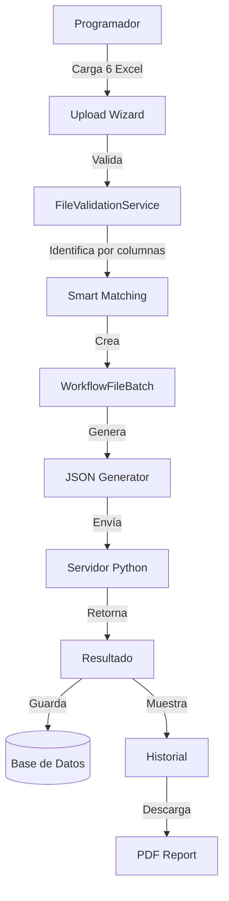

# 🚀 Front-API - Contexto del Proyecto

> **Sistema SaaS de Gestión de Clientes y Automatización de Workflows**  
> Última actualización: Enero 2026 | Versión: 2.2.0

---

## 📋 Descripción General

**Front-API** es un sistema completo de administración SaaS que ha evolucionado para adaptarse a las necesidades reales del negocio:

### Visión Original (2024)
Sistema enfocado en **integraciones automáticas con APIs externas** para:
- Consumir datos de APIs de terceros (Mercado Pago, AFIP, Ualá, Naranja X)
- Procesar transacciones automáticamente
- Ejecutar reglas de negocio ETL con Python
- Sincronización en tiempo real

### Realidad Actual (2026)
**Enfoque híbrido** que combina:
1. **Automatización de procesos manuales** (prioridad actual)
   - Los clientes actualmente procesan datos "a mano" usando Excel
   - El sistema automatiza estos procesos mientras se resuelven problemas con APIs
   - Carga, validación y procesamiento de archivos Excel
   - Ejecución de reglas de negocio en Python sobre datos cargados

2. **Integraciones API** (implementación progresiva)
   - Se mantiene la infraestructura de APIs
   - Se implementarán gradualmente cuando estén disponibles
   - Migración transparente de workflows manuales a automáticos

### Propósito Actual
Permitir a **Programadores** crear workflows de procesamiento de datos (manuales o automáticos), mientras **Operadores** ejecutan estos workflows para sus clientes, ya sea cargando archivos Excel o consumiendo APIs cuando estén disponibles.

---

## 🛠️ Stack Tecnológico

### Backend
| Tecnología | Versión | Uso |
|------------|---------|-----|
| PHP | 8.2+ | Lenguaje principal |
| Laravel | 12.x | Framework principal |
| Spatie/Laravel-Permission | 6.24 | Sistema RBAC de roles y permisos |
| Laravel Breeze | 2.3 | Autenticación |
| Livewire | 3.7 | Componentes reactivos |
| Laravel Sanctum | 4.0 | Autenticación API |
| Pest | 3.8 | Testing |

### Frontend
| Tecnología | Versión | Uso |
|------------|---------|-----|
| Tailwind CSS | 4.x | Estilos (Glassmorphism design) |
| Alpine.js | 3.x | Interactividad JavaScript |
| Chart.js | 4.4.0 | Gráficos y visualizaciones |
| Monaco Editor | - | Editor de código Python |
| Pyodide | - | Ejecución Python en navegador |
| Vite | 7.0 | Build tool |

### Procesamiento de Datos
| Tecnología | Versión | Uso |
|------------|---------|-----|
| Laravel Excel | 3.1+ | Lectura/escritura de archivos Excel |
| PhpSpreadsheet | 1.30+ | Procesamiento de Excel |
| DomPDF | - | Generación de PDFs |
| Python (servidor) | 3.10+ | Ejecución de reglas de negocio |

### Base de Datos
| Tecnología | Versión | Uso |
|------------|---------|-----|
| MySQL | 8.0+ | Base de datos principal |
| SQLite | - | Testing |

---

## 🗂️ Estructura del Proyecto

```
Front-Api/
├── app/
│   ├── Console/Commands/     # Comandos Artisan (ResetDemo, etc.)
│   ├── Http/
│   │   ├── Controllers/      # Controladores principales
│   │   │   ├── Admin/        # Panel administrativo
│   │   │   ├── Api/          # Endpoints REST
│   │   │   ├── Auth/         # Autenticación Breeze
│   │   │   └── Programmer/   # Módulo programador (Integraciones, Business Rules)
│   ├── Livewire/             # Componentes Livewire
│   ├── Models/               # Modelos Eloquent
│   ├── Mail/                 # Mailables
│   ├── Policies/             # Authorization policies
│   └── Services/             # Servicios de negocio
├── database/
│   ├── migrations/           # Migraciones
│   └── seeders/              # Seeders de datos
├── resources/
│   └── views/                # Vistas Blade
├── routes/
│   ├── web.php               # Rutas principales
│   ├── api.php               # Rutas API REST
│   └── auth.php              # Rutas autenticación
├── tests/
│   ├── Feature/              # Tests funcionales
│   └── Unit/                 # Tests unitarios
└── docs/
    └── TEST_DOCUMENTATION.md # Documentación de tests
```

---

## 👥 Sistema de Roles (RBAC)

| Rol | Descripción | Rutas Principales |
|-----|-------------|-------------------|
| **Super Admin** | Acceso total al sistema | `/admin/*` |
| **Manager** | Gestión administrativa (sin config técnica) | `/admin/*` |
| **Programador** | Crea APIs, endpoints, reglas de negocio ETL | `/programadores/*` |
| **Operador** | Ejecuta workflows, gestiona sus clientes | `/dashboard`, `/clients` |

### Permisos por Rol

| Permiso | Super Admin | Manager | Programador | Operador |
|---------|-------------|---------|-------------|----------|
| view clients | ✅ | ✅ | ✅ | ✅ |
| create clients | ✅ | ✅ | ✅ | ✅ |
| delete clients | ✅ | ✅ | ❌ | ❌ |
| reassign clients | ✅ | ✅ | ✅ | ❌ |
| manage api catalog | ✅ | ❌ | ❌ | ❌ |
| manage users | ✅ | ❌ | ❌ | ❌ |

---

## 🔗 Rutas Principales

### Públicas
- `/` - Landing page
- `/login` - Inicio de sesión

### Programador
- `/programadores/dashboard` - Dashboard KPIs
- `/programadores/clients` - Clientes (vista lectura)
- `/programadores/clients/{id}/transfer` - Transferir cliente
- `/programadores/workflows/upload` - Wizard de carga de archivos
- `/programadores/workflows/batch/{id}` - Detalle de batch
- `/programadores/workflows/history` - Historial de ejecuciones
- `/programadores/workflows/execution/{id}/pdf/preview` - Preview PDF
- `/programadores/workflows/execution/{id}/pdf/download` - Descargar PDF

### Administrador
- `/admin/dashboard` - Panel administrativo
- `/admin/users` - Gestión de usuarios

### Compartidas
- `/profile` - Editar perfil de usuario
- `/clients` - Gestión de clientes (CRUD)

---

## 🗄️ Modelos Principales

| Modelo | Tabla | Descripción |
|--------|-------|-------------|
| `User` | `users` | Usuarios del sistema |
| `Client` | `clients` | Clientes (sedes/sucursales con `parent_id`) |
| `Branch` | `branches` | Sucursales de clientes |
| `WorkflowType` | `workflow_types` | Tipos de workflow (Conciliación, etc.) |
| `WorkflowFileDefinition` | `workflow_file_definitions` | Definiciones de archivos por workflow |
| `WorkflowRequiredColumn` | `workflow_required_columns` | Columnas requeridas por archivo |
| `WorkflowFileBatch` | `workflow_file_batches` | Batches de archivos cargados |
| `WorkflowUploadedFile` | `workflow_uploaded_files` | Archivos individuales cargados |
| `WorkflowExecution` | `workflow_executions` | Ejecuciones de workflows |

---

## 📊 Estado Actual del Roadmap

### ✅ ETAPA 1 - Infraestructura API (Completado)
- [x] Panel de Programadores (`/programadores/dashboard`)
- [x] Enterprise Module (Gestión de integraciones)
- [x] Endpoints Manager (`/programadores/services/{id}/endpoints`)
- [x] Reglas de Negocio ETL con Pyodide + Monaco Editor
- [x] Workflow Builder integrado
- [x] Sistema de roles y permisos (Spatie)

### 🚀 ETAPA 2 - Sistema de Workflows (En Desarrollo - Prioridad Alta)
**Objetivo:** Automatizar procesos manuales con Excel mientras se implementan APIs

#### Sprint 1: Fundación (Planificado)
- [ ] Migraciones de BD (workflow_types, file_definitions, etc.)
- [ ] Modelos Eloquent con relaciones
- [ ] Seeder de workflow "Conciliación"
- [ ] Configuración del sistema

#### Sprint 2: Servicios Core (Planificado)
- [ ] FileValidationService (validación inteligente por columnas)
- [ ] WorkflowJsonGeneratorService (generación de JSON)
- [ ] WorkflowExecutionService (ejecución + API Python)
- [ ] WorkflowPdfService (generación de reportes)

#### Sprint 3: UI de Carga (Planificado)
- [ ] Wizard de carga de archivos (4 pasos)
- [ ] Validación en tiempo real
- [ ] Checklist visual de validaciones

#### Sprint 4: Ejecución e Historial (Planificado)
- [ ] Panel de ejecución de workflows
- [ ] Historial de ejecuciones
- [ ] Vista /test para debugging
- [ ] Descarga de PDFs

#### Sprint 5: Configuración UI (Planificado)
- [ ] Admin de tipos de workflow
- [ ] Editor de columnas requeridas
- [ ] Sistema configurable sin código

#### Sprint 6: Testing y Refinamiento (Planificado)
- [ ] Suite de tests completa (>80% coverage)
- [ ] Optimización de performance
- [ ] Documentación completa

### 🔄 ETAPA 3 - Migración Progresiva a APIs (Futuro)
- [ ] Implementar APIs cuando estén disponibles
- [ ] Migración transparente de workflows manuales a automáticos
- [ ] Mantener compatibilidad con ambos métodos

### ✅ ETAPA 4 - Livewire (Instalado)
- [x] Livewire v3.7 instalado
- [x] Componente `BuscadorClientes` creado
- [ ] Dashboard con actualización automática
- [ ] Formularios de reglas en tiempo real
- [ ] Notificaciones en vivo

---

## 🧪 Testing

### Framework: Pest PHP 3.8

```bash
# Ejecutar todos los tests
php artisan test

# Tests de roles específicos
php artisan test --filter=LoginByRoleTest

# Tests de permisos
php artisan test --filter=RoleMatrixTest

# Con salida detallada
php artisan test -v
```

### Configuración
- Base de datos: SQLite (`database/testing.sqlite`)
- Trait: `LazilyRefreshDatabase` (aplicado globalmente)

### Suites de Tests
| Suite | Tests | Descripción |
|-------|-------|-------------|
| LoginByRoleTest | 34 | Acceso por rol |
| RoleMatrixTest | 5 | Matriz de permisos |
| RoleAccessTest | 8 | Acceso a rutas |
| AuthenticationTest | 4 | Login/Logout |
| CredentialFlowTest | 3 | Flujo de credenciales |

---

## ⚡ Instalación Rápida

```bash
# 1. Clonar repositorio
git clone https://github.com/Noodle1981/Front-Api.git
cd Front-Api

# 2. Instalar dependencias
composer install
npm install

# 3. Configurar entorno
cp .env.example .env
php artisan key:generate

# 4. Configurar .env (MySQL)
# DB_DATABASE=front_api
# DB_USERNAME=root
# DB_PASSWORD=

# 5. Ejecutar migraciones y seeders básicos
php artisan migrate --seed

# 6. (Opcional) Cargar datos de demo completos
php artisan db:seed --class=CompleteDemoSeeder

# 7. Compilar assets
npm run dev

# 8. Iniciar servidor
php artisan serve
# Acceder a: http://127.0.0.1:8000
```

### Comando de Reset Demo
```bash
php artisan app:reset-demo
# Ejecuta migrate:fresh + secuencia correcta de seeders
```

---

## 👤 Usuarios de Demo

| Email | Password | Rol | Datos |
|-------|----------|-----|-------|
| `admin@example.com` | `password` | Super Admin | Acceso total |
| `user@example.com` | `password` | Operador | 5 Sedes, 4 Sucursales (ideal presentaciones) |
| `analista@example.com` | `password` | Programador | Vista global |
| `maria.gonzalez@demo.com` | `password123` | Operador | 2 sedes |
| `carlos.rodriguez@demo.com` | `password123` | Operador | 2 sedes |

---

## 📐 Convenciones de Código

### Nombrado
- **Controladores**: PascalCase, singular (`ClientController`, `ApiServiceController`)
- **Modelos**: PascalCase, singular (`Client`, `ApiService`)
- **Vistas**: kebab-case en carpetas por módulo (`programmer/dashboard.blade.php`)
- **Rutas**: kebab-case, agrupadas por prefijo (`/programadores/api-dashboard`)
- **Migraciones**: snake_case con timestamp

### Organización por Rol
- `app/Http/Controllers/Admin/` → Super Admin, Manager
- `app/Http/Controllers/Programmer/` → Programador
- `app/Http/Controllers/` → Compartido o Operador

### Vistas Blade
- Layout principal: `layouts/app.blade.php`
- Componentes Blade en: `resources/views/components/`
- Componentes Livewire en: `app/Livewire/`

### Diseño UI
- **Glassmorphism**: `backdrop-blur-md`, transparencias, gradientes
- **Dark Theme**: Tema oscuro con acentos de color
- **Responsive**: Mobile-first con Tailwind breakpoints

---

## 🔀 Convenciones Git

### Ramas
- `main` - Producción estable
- `develop` - Desarrollo activo
- `feature/nombre-feature` - Features nuevas
- `fix/descripcion-bug` - Correcciones

### Commits
```bash
# Ejemplos de mensajes de commit
feat: add endpoint testing panel
fix: resolve client pagination issue
docs: update README with new routes
refactor: extract API service logic
test: add role matrix tests
```

### Flujo
1. Fork del proyecto
2. Crear rama `git checkout -b feature/AmazingFeature`
3. Commit cambios `git commit -m 'feat: add AmazingFeature'`
4. Push `git push origin feature/AmazingFeature`
5. Abrir Pull Request

---

## 📧 Configuración Email (SMTP)

```env
# Gmail
MAIL_MAILER=smtp
MAIL_HOST=smtp.gmail.com
MAIL_PORT=587
MAIL_USERNAME=tu-email@gmail.com
MAIL_PASSWORD=tu-app-password
MAIL_ENCRYPTION=tls

# Mailtrap (Testing)
MAIL_HOST=smtp.mailtrap.io
MAIL_PORT=2525
```

Después de cambios: `php artisan config:clear`

---

## 📚 Documentación Clave

| Archivo | Ubicación | Contenido |
|---------|-----------|-----------|
| README.md | `/README.md` | Documentación principal |
| ROADMAP.MP | `/ROADMAP.MP` | Estado del roadmap |
| TEST_DOCUMENTATION.md | `/docs/TEST_DOCUMENTATION.md` | Documentación de tests |
| phpunit.xml | `/phpunit.xml` | Configuración PHPUnit |
| composer.json | `/composer.json` | Dependencias PHP |
| package.json | `/package.json` | Dependencias NPM |

---

## 🛟 Comandos Útiles

```bash
# Desarrollo
composer dev                  # Server + Queue + Pail + Vite concurrente
php artisan serve             # Solo servidor
npm run dev                   # Solo Vite

# Base de datos
php artisan migrate           # Ejecutar migraciones
php artisan migrate:fresh     # Reset + migrate
php artisan db:seed           # Ejecutar seeders
php artisan app:reset-demo    # Reset demo completo

# Cache
php artisan config:clear      # Limpiar config cache
php artisan cache:clear       # Limpiar application cache
php artisan view:clear        # Limpiar compiled views

# Testing
php artisan test              # Ejecutar todos los tests
php artisan test --filter=X   # Filtrar por nombre

# Utilidades
php artisan tinker            # REPL de Laravel
php artisan route:list        # Listar rutas
php artisan make:controller   # Crear controlador
php artisan make:model        # Crear modelo
php artisan make:livewire     # Crear componente Livewire
```

---

## 🔄 Sistema de Workflows (Nuevo - Enero 2026)

### Contexto y Motivación

**Problema Original:**
- El proyecto nació para automatizar integraciones con APIs externas
- Problemas con disponibilidad y estabilidad de APIs de terceros
- Clientes procesando datos manualmente en Excel mientras se resuelven problemas

**Solución Implementada:**
Sistema híbrido que permite:
1. **Automatizar procesos manuales** (corto plazo)
2. **Migrar a APIs** cuando estén disponibles (largo plazo)
3. **Coexistencia** de ambos métodos

### Arquitectura del Sistema



### Características Clave

#### 1. Validación Inteligente
- **No depende del nombre del archivo**
- Identifica tipo por estructura de columnas
- Normalización automática de nombres
- Detección de archivos duplicados/faltantes

#### 2. Sistema Configurable
- Gestión de workflows desde UI
- Edición de columnas requeridas sin código
- Columnas obligatorias vs opcionales
- Escalable a múltiples workflows

#### 3. Procesamiento Flexible
- JSON incluye TODOS los campos (no solo validados)
- Programador Python tiene acceso completo a datos
- Reglas de negocio personalizables
- Mock API para desarrollo

#### 4. Trazabilidad Completa
- Historial de todas las ejecuciones
- Logs detallados
- Generación de PDFs
- Auditoría completa

### Workflow "Conciliación" (Primer Caso de Uso)

**Archivos Requeridos:**
1. `Turnos.xlsx` - Turnos de caja
2. `Reporte Ventas.xlsx` - Ventas del sistema
3. `Reporte getnet.xlsx` - Transacciones Getnet
4. `Ventas MP.xlsx` - Transacciones Mercado Pago
5. `Devoluciones.xlsx` - Devoluciones/anulaciones
6. `Caja Adicion.xlsx` - Movimientos de caja

**Proceso:**
1. Programador carga 6 archivos
2. Sistema valida estructura
3. Genera JSON consolidado
4. Envía a servidor Python
5. Python ejecuta reglas de conciliación
6. Retorna resultado con diferencias
7. Se genera PDF con reporte

### Migración Futura a APIs

Cuando las APIs estén disponibles:
- El mismo workflow "Conciliación" funcionará
- En lugar de cargar Excel, consumirá APIs
- Reglas de negocio Python se mantienen
- Migración transparente para el usuario

### Documentación

| Documento | Ubicación | Contenido |
|-----------|-----------|-----------|
| README Principal | `docs/Desarrollos/workflows_README.md` | Índice maestro |
| Plan de Implementación | `docs/Desarrollos/workflows_implementation_plan.md` | Detalles técnicos |
| Diagramas | `docs/Lógica_del_diseño/workflows_diagrama.md` | Flujos visuales |
| Validación | `docs/Lógica_del_diseño/workflows_validation_strategy.md` | Estrategia de validación |
| Sistema Configurable | `docs/Lógica_del_diseño/workflows_configurable_system.md` | UI de administración |
| Escalabilidad | `docs/Lógica_del_diseño/workflows_escalabilidad.md` | Capacidades futuras |
| Roadmap | `docs/Roadmap/workflows_roadmap.md` | Plan de 6 sprints |
| Roadmap Visual | `docs/Roadmap/workflows_roadmap_visual.md` | Diagramas y timeline |

---

## ⚠️ Notas Importantes

1. **Credenciales API**: Se almacenan encriptadas en `client_credentials.credentials`
2. **Soft Deletes**: Los clientes usan eliminación lógica
3. **Jerarquías**: Los clientes pueden ser sedes (`parent_id = null`) o sucursales (`parent_id = sede_id`)
4. **Pyodide**: Se ejecuta en el navegador, no requiere instalación Python en servidor
5. **Roles renombrados**: Analista → Programador, Usuario → Operador
6. **Workflows**: Sistema híbrido que automatiza procesos manuales (Excel) mientras se implementan APIs
7. **Validación Inteligente**: Los archivos se identifican por estructura de columnas, no por nombre
8. **Escalabilidad**: El sistema de workflows es configurable y soporta múltiples tipos de workflow

---

**Desarrollado por**: Omar Olivera ([@Noodle1981](https://github.com/Noodle1981))  
**Repositorio**: [github.com/Noodle1981/Front-Api](https://github.com/Noodle1981/Front-Api)  
**Última actualización**: Enero 2026 - Sistema de Workflows implementado
```
