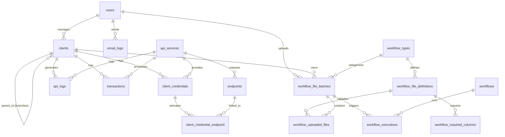

# 📊 Auditoría de Tablas de Base de Datos

> **Fecha de Auditoría:** 2026-01-06  
> **Total de Migraciones:** 30 archivos  
> **Total de Tablas:** 27 tablas

---

## 📋 Inventario Completo de Tablas

### 🔵 Tablas Core (Laravel Framework)

| Tabla | Propósito | Origen |
|-------|-----------|--------|
| `users` | Usuarios del sistema | Laravel default |
| `password_reset_tokens` | Tokens de recuperación de contraseña | Laravel default |
| `sessions` | Sesiones de usuarios | Laravel default |
| `cache` | Caché del sistema | Laravel default |
| `cache_locks` | Bloqueos de caché | Laravel default |
| `jobs` | Cola de trabajos | Laravel Queue |
| `job_batches` | Lotes de trabajos | Laravel Queue |
| `failed_jobs` | Trabajos fallidos | Laravel Queue |
| `personal_access_tokens` | Tokens API (Sanctum) | Laravel Sanctum |

### 🟢 Tablas de Permisos (Spatie Permission)

| Tabla | Propósito | Relaciones |
|-------|-----------|------------|
| `permissions` | Permisos del sistema | - |
| `roles` | Roles de usuario | - |
| `model_has_permissions` | Pivot: modelos-permisos | `permissions` (morph) |
| `model_has_roles` | Pivot: modelos-roles | `roles` (morph) |
| `role_has_permissions` | Pivot: roles-permisos | `permissions`, `roles` |

### 🟠 Tablas de Negocio Principal

| Tabla | Propósito | Relaciones |
|-------|-----------|------------|
| `clients` | Clientes/empresas | FK a `clients` (parent), FK a `users` |
| `settings` | Configuraciones globales | - |
| `api_services` | Servicios de API registrados | - |
| `client_credentials` | Credenciales de API por cliente | FK a `clients`, `api_services` |
| `endpoints` | Endpoints de APIs | FK a `api_services` |
| `client_credential_endpoint` | Pivot: credenciales-endpoints | FK a `client_credentials`, `endpoints` |
| `api_logs` | Logs de llamadas API | FK a `clients`, `api_services` |
| `transactions` | Transacciones financieras | FK a `clients`, `api_services` |
| `email_logs` | Historial de emails | FK a `users` |

### 🟣 Tablas de Workflows (Sistema Nuevo)

| Tabla | Propósito | Relaciones |
|-------|-----------|------------|
| `workflows` | Definición de workflows | - |
| `workflow_executions` | Ejecuciones de workflows | FK a `workflows`, `workflow_file_batches` |
| `workflow_types` | Tipos de workflow configurables | - |
| `workflow_file_definitions` | Definiciones de archivos por tipo | FK a `workflow_types` |
| `workflow_required_columns` | Columnas requeridas por archivo | FK a `workflow_file_definitions` |
| `workflow_file_batches` | Lotes de archivos subidos | FK a `workflow_types`, `clients` (x2), `users` |
| `workflow_uploaded_files` | Archivos subidos individuales | FK a `workflow_file_batches`, `workflow_file_definitions` |
| `business_rules` | Reglas de negocio (scripts Python) | - |

---

## ⚠️ Hallazgos de la Auditoría

### 🔴 Problemas Críticos

#### 1. **Duplicación Potencial: `workflows` vs `workflow_types`**

> [!CAUTION]
> Existen DOS tablas que representan conceptos muy similares:

| Tabla | Campos | Propósito Aparente |
|-------|--------|-------------------|
| `workflows` | `name`, `description`, `trigger_type`, `schedule`, `steps_json`, `is_active` | Workflows complejos con lógica de pasos |
| `workflow_types` | `name`, `description`, `is_active`, `expected_files_count` | Tipos de workflow para subida de archivos |

**Análisis:**
- `workflows` parece ser un sistema de automatización más complejo (trigger_type, schedule, steps_json)
- `workflow_types` es más simple y orientado a la validación de archivos

**Recomendación:** 
- ✅ **Mantener ambas** si se usan para propósitos diferentes
- ⚠️ **Fusionar** si `workflows` no se está utilizando activamente
- 📝 **Renombrar** para clarificar propósitos (ej: `automation_workflows` vs `file_workflow_types`)

#### 2. **FK Nullable Inconsistente en `workflow_executions`**

```php
// Migración original
$table->foreignId('workflow_id')->constrained('workflows')->onDelete('cascade');

// Migración posterior
$table->foreignId('workflow_id')->nullable()->change();
```

> [!WARNING]
> La tabla `workflow_executions` tiene `workflow_id` que fue hecho nullable posteriormente, pero también tiene `workflow_file_batch_id` (también nullable).
> Esto permite ejecuciones "huérfanas" sin relación clara.

**Recomendación:**
- Establecer una constraint: al menos UNO de los dos debe ser NOT NULL
- O definir claramente el caso de uso donde ambos pueden ser NULL

---

### 🟡 Problemas Menores

#### 3. **Migraciones Duplicadas para misma columna**

Las siguientes migraciones agregan la misma columna `columns_count`:

| Archivo | Fecha | Acción |
|---------|-------|--------|
| `2026_01_04_172505_add_metadata_columns_to_workflow_uploaded_files_table.php` | 04/01/2026 | Agrega `columns_count` |
| `2026_01_04_173035_add_columns_count_to_workflow_uploaded_files.php` | 04/01/2026 | Agrega `columns_count` (con hasColumn check) |

> [!NOTE]
> Aunque no causa errores (usa `hasColumn` check), indica desarrollo apresurado.

**Recomendación:** 
- Eliminar la migración redundante (`173035`)
- Consolidar migraciones antes de producción

#### 4. **Método `down()` Incompleto**

```php
// 2025_12_18_023332_add_automation_fields_to_client_credentials_table.php
public function down(): void
{
    Schema::table('client_credentials', function (Blueprint $table) {
        // VACÍO - No revierte los cambios
    });
}
```

> [!WARNING]
> No se pueden revertir las columnas `execution_frequency` y `alert_email`.

---

### 🟢 Buenas Prácticas Identificadas

1. ✅ **Uso consistente de `onDelete('cascade')`** en FKs
2. ✅ **Índices apropiados** en columnas de búsqueda frecuente
3. ✅ **Comentarios descriptivos** en columnas importantes
4. ✅ **Soft deletes** implementado en `clients`
5. ✅ **UUID público** en `clients` para exposición externa
6. ✅ **Estructura jerárquica** bien implementada (parent_id en clients)
7. ✅ **Timestamps consistentes** en todas las tablas

---

## 📊 Diagrama de Relaciones



---

## 📈 Estadísticas por Categoría

| Categoría | Cantidad | % del Total |
|-----------|----------|-------------|
| Core Laravel | 9 | 33% |
| Permisos (Spatie) | 5 | 19% |
| Negocio Principal | 9 | 33% |
| Sistema Workflow | 8 | 30% |

> **Nota:** Algunas tablas pueden pertenecer a múltiples categorías conceptualmente.

---

## 🔧 Recomendaciones de Acción

### Alta Prioridad

1. **Clarificar `workflows` vs `workflow_types`**
   - Documentar cuándo usar cada uno
   - Considerar renombrar para evitar confusión

2. **Revisar integridad de `workflow_executions`**
   - Agregar constraint CHECK o trigger para validar al menos una FK

### Media Prioridad

3. **Consolidar migraciones de workflow**
   - Antes de ir a producción, crear una migración única consolidada
   - Eliminar migraciones redundantes

4. **Completar métodos `down()`**
   - Revisar todas las migraciones para rollbacks apropiados

### Baja Prioridad

5. **Considerar tabla `business_rules`**
   - Actualmente no tiene FK ni se usa en relaciones
   - Evaluar si se integrará al sistema de workflows

---

## 📝 Notas Adicionales

### Sobre la Tabla `settings`

La tabla `settings` usa un patrón key-value simple:
```sql
key VARCHAR UNIQUE
value VARCHAR NULLABLE
```

Este patrón es flexible pero puede volverse difícil de mantener. Considerar:
- Migrar a un archivo de configuración para settings estáticos
- Usar JSON para settings complejos
- Documentar qué keys existen y sus valores esperados

### Sobre el Sistema de Workflows

El sistema de workflows tiene dos "capas":

1. **Capa de Automatización** (`workflows`, `workflow_executions`, `business_rules`)
   - Enfocada en automatización y scripts Python
   
2. **Capa de Archivos** (`workflow_types`, `workflow_file_definitions`, `workflow_required_columns`, `workflow_file_batches`, `workflow_uploaded_files`)
   - Enfocada en validación y procesamiento de archivos

Estas capas están conectadas a través de `workflow_executions` que puede referenciar tanto `workflows` como `workflow_file_batches`.

---

*Documento generado automáticamente como parte de la auditoría del esquema de base de datos.*
