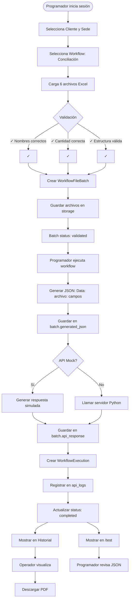
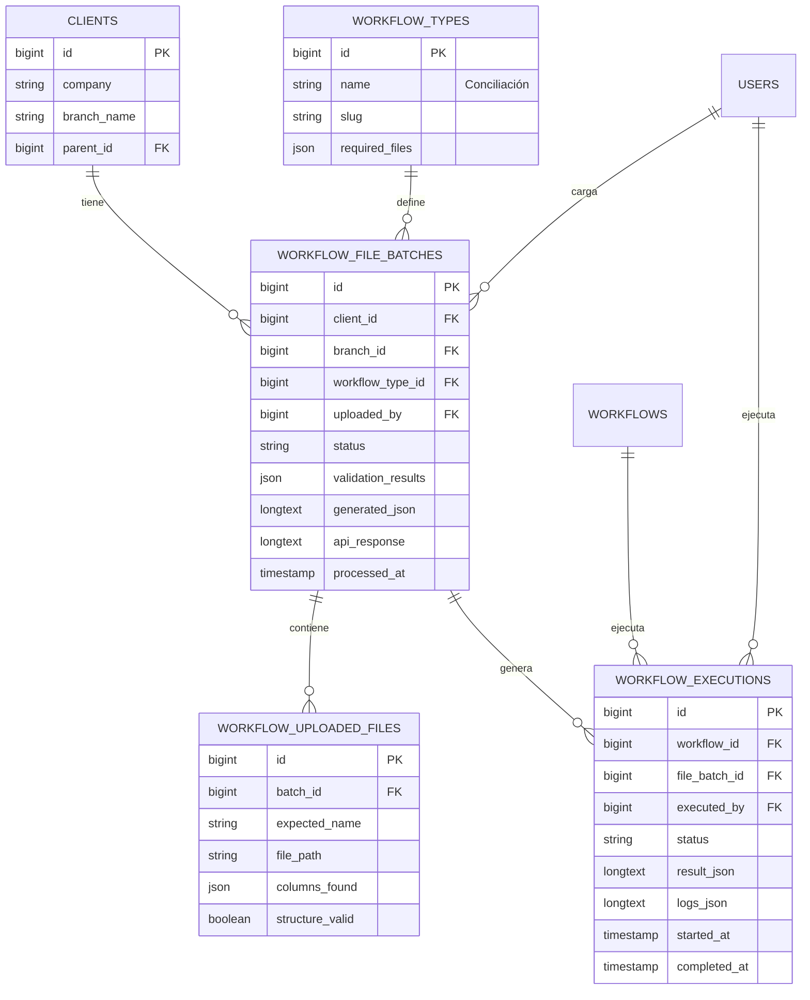

# Diagrama de Flujo: Sistema de Conciliación

## Flujo Completo del Sistema



## Arquitectura de Base de Datos



## Estructura JSON

### JSON Enviado al Servidor

```json
{
  "Data": {
    "Turnos": [
      {
        "Fecha Apertura": "2024-01-15",
        "Hs Ap. Caja": "08:00",
        "Fecha Cierre": "2024-01-15",
        "Hs Cierre Caja": "20:00",
        "TURNO": "1",
        "Encargado": "Juan Pérez",
        "APERTURA CAJA Efectivo": "5000.00",
        "Recuento Efectivo": "45000.00"
      }
    ],
    "Reporte_Ventas": [
      {
        "FechaCierre": "2024-01-15",
        "Comanda": "001",
        "Total": "1500.00",
        "Propina": "150.00",
        "Pagos": "Efectivo",
        "Boleta": "A-0001",
        "Efectivo": "1500.00",
        "Getnet": "0.00",
        "Mercado Pago": "0.00",
        "Cta Cte": "0.00"
      }
    ],
    "Reporte_getnet": [...],
    "Prueba_MP": [...],
    "Devoluciones": [...],
    "Caja_Adicion": [...]
  },
  "metadata": {
    "client_id": 1,
    "branch_id": 2,
    "uploaded_at": "2024-01-15T10:30:00-03:00",
    "workflow_type": "Conciliación"
  }
}
```

### Respuesta del Servidor Python

```json
{
  "status": "success",
  "result": {
    "total_ventas": 125000.50,
    "total_efectivo": 45000.00,
    "total_getnet": 50000.50,
    "total_mp": 30000.00,
    "diferencias": [
      {
        "tipo": "Descuadre en turno 1",
        "monto": -150.00,
        "detalle": "Faltante en cierre de caja"
      },
      {
        "tipo": "Faltante Getnet",
        "monto": -50.50,
        "detalle": "Transacción no registrada"
      }
    ],
    "observaciones": "Conciliación completada con 2 diferencias menores",
    "recomendaciones": [
      "Revisar procedimiento de cierre de turno 1",
      "Verificar sincronización con Getnet"
    ]
  },
  "processed_at": "2024-01-15T10:35:42-03:00"
}
```

## Roles y Permisos

| Acción | Programador | Operador | Admin |
|--------|-------------|----------|-------|
| Cargar archivos | ✅ | ❌ | ✅ |
| Ejecutar workflow | ✅ | ❌ | ✅ |
| Ver historial | ✅ | ✅ | ✅ |
| Descargar PDF | ✅ | ✅ | ✅ |
| Ver /test | ✅ | ❌ | ✅ |

## Checklist de Validación

Durante la carga de archivos, el sistema verifica:

- ✅ **Cantidad de archivos**: Exactamente 6 archivos
- ✅ **Nombres de archivos**: 
  - Turnos.xlsx
  - Reporte_Ventas.xlsx
  - Reporte_getnet.xlsx
  - Prueba_MP.xlsx
  - Devoluciones.xlsx
  - Caja_Adicion.xlsx
- ✅ **Estructura de columnas**: Cada archivo debe tener las columnas especificadas
- ✅ **Formato**: Todos deben ser archivos Excel válidos (.xlsx)
- ✅ **Contenido**: Al menos 1 fila de datos (además del header)
