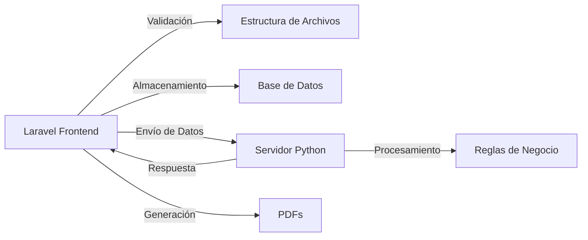
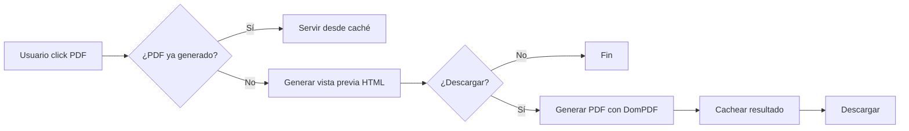

# Escalabilidad del Sistema de Workflows

## Visión General

El sistema está diseñado para ser **completamente escalable** en múltiples dimensiones:

1. **Tipos de Workflows** - Agregar nuevos workflows sin modificar código
2. **Archivos por Workflow** - Cantidad configurable de archivos requeridos
3. **Columnas por Archivo** - Estructura flexible y extensible
4. **Clientes y Sedes** - Soporte ilimitado de organizaciones
5. **Volumen de Datos** - Procesamiento eficiente de grandes volúmenes
6. **Reglas de Negocio** - Lógica personalizable en servidor Python

---

## Dimensiones de Escalabilidad

### 1. Múltiples Tipos de Workflows

**Capacidad:** Ilimitada

El sistema actual soporta "Conciliación", pero puede extenderse fácilmente:

```
✅ Conciliación (implementado)
⏳ Inventario
⏳ Nómina
⏳ Facturación
⏳ Auditoría Fiscal
⏳ Control de Calidad
⏳ Análisis de Ventas
⏳ ... cualquier otro
```

#### Cómo Agregar un Nuevo Workflow

**Opción 1: Configuración en Base de Datos**

```sql
-- 1. Crear tipo de workflow
INSERT INTO workflow_types (name, slug, description, is_active)
VALUES ('Inventario', 'inventario', 'Control mensual de inventario', true);

-- 2. Definir archivos requeridos
INSERT INTO workflow_file_definitions (workflow_type_id, file_key, display_name, required_columns, is_required)
VALUES 
  (2, 'stock_actual', 'Stock Actual', '["Código", "Producto", "Cantidad", "Ubicación"]', true),
  (2, 'movimientos', 'Movimientos', '["Fecha", "Tipo", "Código", "Cantidad"]', true),
  (2, 'ajustes', 'Ajustes', '["Código", "Cantidad_Anterior", "Cantidad_Nueva", "Motivo"]', true);
```

**Opción 2: Interfaz de Administración (Futuro)**

```
1. Ir a /admin/workflows/types
2. Click "Crear Nuevo Workflow"
3. Completar formulario:
   - Nombre: "Inventario"
   - Descripción: "Control mensual de inventario"
   - Archivos requeridos: 3
4. Definir cada archivo:
   - Nombre clave: "stock_actual"
   - Nombre visible: "Stock Actual"
   - Columnas requeridas: ["Código", "Producto", "Cantidad", "Ubicación"]
5. Guardar
```

**Tiempo estimado:** 15-30 minutos de configuración

---

### 2. Archivos por Workflow

**Capacidad:** Configurable (no limitado a 6)

Cada workflow puede tener diferente cantidad de archivos:

| Workflow | Archivos Requeridos | Archivos Opcionales |
|----------|---------------------|---------------------|
| Conciliación | 6 | 0 |
| Inventario | 3 | 1 |
| Nómina | 5 | 3 |
| Facturación | 2 | 0 |

#### Archivos Opcionales

Marcar `is_required = false` en `workflow_file_definitions`:

```php
// Ejemplo: Devoluciones es opcional
[
    'file_key' => 'devoluciones',
    'display_name' => 'Devoluciones',
    'required_columns' => ['ID Comanda', 'Producto', 'Precio'],
    'is_required' => false  // ← Opcional
]
```

**Resultado:**
- ✅ Si se carga, se valida normalmente
- ✅ Si no se carga, no genera error
- ✅ Python recibe el archivo solo si existe

---

### 3. Columnas por Archivo

**Capacidad:** Ilimitada y flexible

#### Tipos de Columnas

1. **Columnas Requeridas** - Deben estar presentes para validación
2. **Columnas Opcionales** - Se incluyen si existen
3. **Columnas Extra** - Se incluyen automáticamente en el JSON

#### Ejemplo de Flexibilidad

**Archivo "Turnos" con evolución:**

```json
// Versión 1.0 (Inicial)
{
  "required_columns": [
    "Fecha Apertura",
    "TURNO",
    "Encargado"
  ]
}

// Versión 2.0 (Agregamos columnas)
{
  "required_columns": [
    "Fecha Apertura",
    "TURNO",
    "Encargado",
    "Supervisor",        // ← Nueva columna requerida
    "Cantidad Comensales" // ← Nueva columna requerida
  ]
}

// Versión 3.0 (Columnas opcionales)
{
  "required_columns": [
    "Fecha Apertura",
    "TURNO",
    "Encargado"
  ],
  "optional_columns": [
    "Supervisor",         // ← Ahora opcional
    "Cantidad Comensales",
    "Observaciones"       // ← Nueva opcional
  ]
}
```

**Ventaja:** El JSON siempre incluye TODAS las columnas del Excel, no solo las validadas.

---

### 4. Múltiples Clientes y Sedes

**Capacidad:** Ilimitada

#### Estructura Jerárquica

```
Cliente Matriz (parent_id = NULL)
├── Sede Centro (parent_id = 1)
├── Sede Norte (parent_id = 1)
├── Sede Sur (parent_id = 1)
└── Sede Este (parent_id = 1)

Cliente B (parent_id = NULL)
├── Sucursal Única (parent_id = 5)
```

#### Ejecuciones Independientes

Cada combinación cliente-sede-workflow genera ejecuciones separadas:

```
Cliente A - Sede Centro - Conciliación - Enero 2025
Cliente A - Sede Centro - Conciliación - Febrero 2025
Cliente A - Sede Norte - Conciliación - Enero 2025
Cliente B - Sucursal Única - Conciliación - Enero 2025
```

**Beneficios:**
- ✅ Trazabilidad completa
- ✅ Comparación entre sedes
- ✅ Análisis histórico
- ✅ Auditoría por sede

---

### 5. Volumen de Datos

#### Límites Actuales

| Aspecto | Límite Actual | Límite Recomendado |
|---------|---------------|-------------------|
| Tamaño de archivo | 10 MB | 50 MB |
| Filas por archivo | Sin límite | 100,000 |
| Archivos por batch | 6 (configurable) | 20 |
| Ejecuciones simultáneas | 1 | 5 |

#### Optimizaciones Implementadas

1. **Lectura Eficiente de Excel**
   ```php
   // PhpSpreadsheet con lectura por chunks
   $reader = IOFactory::createReader('Xlsx');
   $reader->setReadDataOnly(true);
   $spreadsheet = $reader->load($filePath);
   ```

2. **Almacenamiento JSON Comprimido**
   ```php
   // Guardar en longtext con compresión
   $batch->response_data = json_encode($data, JSON_UNESCAPED_UNICODE);
   ```

3. **Generación de PDF Bajo Demanda**
   - No se genera hasta que el usuario lo solicita
   - Vista previa HTML es ligera
   - PDF se genera solo al descargar

#### Escalabilidad Futura

**Para volúmenes muy grandes (>100k filas):**

1. **Queue System**
   ```php
   // Procesar en background con Laravel Queues
   dispatch(new ProcessWorkflowBatch($batch));
   ```

2. **Streaming de Datos**
   ```php
   // Leer Excel por chunks
   $chunkSize = 1000;
   foreach ($reader->getWorksheetIterator() as $worksheet) {
       foreach ($worksheet->getRowIterator() as $row) {
           // Procesar fila por fila
       }
   }
   ```

3. **Caché de Resultados**
   ```php
   // Cachear PDFs generados
   Cache::remember("pdf_{$execution->id}", 3600, function() {
       return $this->generatePdf();
   });
   ```

---

### 6. Reglas de Negocio Personalizables

#### Libertad Total en Python

El servidor Python recibe **TODOS** los datos:

```json
{
  "workflow_type": "conciliacion",
  "batch_id": 14,
  "files": [
    {
      "type": "turnos",
      "path": "/storage/workflows/batch_14/turnos.xlsx",
      "data": [
        {
          "Fecha Apertura": "2024-01-15",
          "TURNO": "1",
          "Encargado": "Juan",
          "Supervisor": "María",           // ← Columna extra
          "Cantidad Comensales": "150",    // ← Columna extra
          "Observaciones": "Todo OK",      // ← Columna extra
          "Campo_Nuevo": "Valor"           // ← Cualquier columna
        }
      ]
    }
  ]
}
```

#### Ejemplos de Reglas Complejas

**Regla 1: Validación con Múltiples Archivos**

```python
def validar_conciliacion_completa(data):
    turnos = data['files'][0]['data']
    ventas = data['files'][1]['data']
    getnet = data['files'][2]['data']
    mp = data['files'][3]['data']
    
    # Combinar datos de múltiples fuentes
    total_efectivo_turnos = sum(float(t['Recuento Efectivo']) for t in turnos)
    total_efectivo_ventas = sum(float(v['Efectivo']) for v in ventas)
    total_getnet = sum(float(g['Monto Bruto Transaccion']) for g in getnet)
    total_mp = sum(float(m['VALOR DE LA COMPRA']) for m in mp)
    
    # Cálculos complejos
    diferencia_efectivo = total_efectivo_turnos - total_efectivo_ventas
    total_digital = total_getnet + total_mp
    
    return {
        'diferencias': {
            'efectivo': diferencia_efectivo,
            'digital': 0  # Asumiendo que coincide
        },
        'totales': {
            'efectivo': total_efectivo_turnos,
            'getnet': total_getnet,
            'mercado_pago': total_mp
        }
    }
```

**Regla 2: Uso de Columnas Opcionales**

```python
def calcular_estadisticas_avanzadas(data):
    turnos = data['files'][0]['data']
    
    # Usar campos opcionales con valores por defecto
    total_comensales = sum(
        int(t.get('Cantidad Comensales', 0)) 
        for t in turnos
    )
    
    # Calcular solo si existe el campo
    if 'Supervisor' in turnos[0]:
        supervisores = set(t['Supervisor'] for t in turnos)
        return {
            'comensales': total_comensales,
            'supervisores': list(supervisores),
            'turnos_por_supervisor': {
                s: len([t for t in turnos if t['Supervisor'] == s])
                for s in supervisores
            }
        }
    
    return {
        'comensales': total_comensales
    }
```

---

## Arquitectura Escalable

### Separación de Responsabilidades



**Ventajas:**
- ✅ Laravel: UI, validación, almacenamiento
- ✅ Python: Lógica de negocio compleja
- ✅ Cada uno hace lo que mejor sabe hacer
- ✅ Fácil de escalar independientemente

### Base de Datos Normalizada

```
workflow_types (1)
    ↓
workflow_file_definitions (N) ← Cada workflow tiene N archivos
    ↓
workflow_file_batches (M) ← Múltiples ejecuciones
    ↓
workflow_uploaded_files (K) ← Archivos de cada batch
    ↓
workflow_executions (L) ← Resultados de procesamiento
```

**Beneficios:**
- ✅ Sin duplicación de datos
- ✅ Fácil de consultar
- ✅ Fácil de modificar
- ✅ Auditoría completa

---

## Casos de Uso de Escalabilidad

### Caso 1: Agregar Workflow "Nómina"

**Archivos necesarios:**
1. `empleados.xlsx` - Datos de empleados
2. `asistencias.xlsx` - Registro de asistencias
3. `horas_extra.xlsx` - Horas extra trabajadas
4. `deducciones.xlsx` - Deducciones aplicables
5. `bonos.xlsx` - Bonos y comisiones

**Proceso:**

```sql
-- 1. Crear workflow
INSERT INTO workflow_types (name, slug, description)
VALUES ('Nómina', 'nomina', 'Procesamiento de nómina mensual');

-- 2. Definir archivos
INSERT INTO workflow_file_definitions (workflow_type_id, file_key, display_name, required_columns)
VALUES 
  (2, 'empleados', 'Empleados', '["ID", "Nombre", "Salario_Base", "Cargo"]'),
  (2, 'asistencias', 'Asistencias', '["ID_Empleado", "Fecha", "Hora_Entrada", "Hora_Salida"]'),
  (2, 'horas_extra', 'Horas Extra', '["ID_Empleado", "Fecha", "Horas", "Tipo"]'),
  (2, 'deducciones', 'Deducciones', '["ID_Empleado", "Concepto", "Monto"]'),
  (2, 'bonos', 'Bonos', '["ID_Empleado", "Concepto", "Monto"]');

-- 3. Crear servidor Python para procesar
-- 4. Listo para usar
```

**Tiempo:** 30 minutos de configuración + desarrollo de reglas Python

---

### Caso 2: Modificar Workflow Existente

**Situación:** Descubres que "Turnos" también tiene columna "Temperatura_Ambiente"

**Proceso:**

```sql
-- Opción 1: Agregar como requerida
UPDATE workflow_file_definitions
SET required_columns = JSON_ARRAY_APPEND(required_columns, '$', 'Temperatura_Ambiente')
WHERE file_key = 'turnos';

-- Opción 2: Dejar como opcional (no hacer nada)
-- El sistema automáticamente incluirá la columna en el JSON si existe
```

**Impacto:**
- ✅ Próximas cargas incluirán "Temperatura_Ambiente"
- ✅ Python puede usar el campo en reglas
- ✅ Cargas anteriores no se ven afectadas
- ✅ No requiere cambios en código

**Tiempo:** 2 minutos

---

### Caso 3: Escalar a Múltiples Sedes

**Situación:** Cliente tiene 50 sucursales

**Solución:**

```php
// Crear sedes programáticamente
$matriz = Client::find(1);

for ($i = 1; $i <= 50; $i++) {
    Client::create([
        'company' => "Sucursal $i",
        'parent_id' => $matriz->id,
        'branch_name' => "SUC-" . str_pad($i, 3, '0', STR_PAD_LEFT)
    ]);
}
```

**Resultado:**
- ✅ 50 sedes independientes
- ✅ Cada una puede ejecutar workflows
- ✅ Reportes consolidados posibles
- ✅ Análisis comparativo entre sedes

---

## Sistema de PDFs Escalable

### Generación Bajo Demanda



**Ventajas:**
- ✅ No se generan PDFs innecesarios
- ✅ Vista previa es instantánea
- ✅ PDF se genera solo cuando se necesita
- ✅ Resultados se pueden cachear

### Templates Personalizables

Cada tipo de workflow puede tener su propio template:

```
resources/views/pdfs/
├── workflow-conciliacion-preview.blade.php
├── workflow-conciliacion-pdf.blade.php
├── workflow-inventario-preview.blade.php
├── workflow-inventario-pdf.blade.php
├── workflow-nomina-preview.blade.php
└── workflow-nomina-pdf.blade.php
```

**Proceso para nuevo workflow:**

1. Copiar template existente
2. Adaptar secciones según datos del workflow
3. Actualizar controlador para usar nuevo template
4. Listo

**Tiempo:** 1-2 horas por template

---

## Optimizaciones de Performance

### 1. Índices de Base de Datos

```sql
-- Índices para consultas frecuentes
CREATE INDEX idx_batches_client_branch ON workflow_file_batches(client_id, branch_id);
CREATE INDEX idx_batches_status ON workflow_file_batches(status);
CREATE INDEX idx_executions_batch ON workflow_executions(file_batch_id);
CREATE INDEX idx_executions_status ON workflow_executions(status);
CREATE INDEX idx_files_batch ON workflow_uploaded_files(batch_id);
```

### 2. Eager Loading

```php
// Evitar N+1 queries
$executions = WorkflowExecution::with([
    'fileBatch.client',
    'fileBatch.workflowType',
    'fileBatch.user'
])->paginate(50);
```

### 3. Paginación

```php
// Historial con paginación
$executions = WorkflowExecution::latest()
    ->paginate(50);  // 50 por página
```

### 4. Compresión de JSON

```php
// Para JSONs muy grandes
$compressed = gzcompress(json_encode($data));
$batch->response_data = base64_encode($compressed);

// Al leer
$data = json_decode(gzuncompress(base64_decode($batch->response_data)), true);
```

---

## Límites y Recomendaciones

### Límites Técnicos

| Recurso | Límite Soft | Límite Hard | Recomendación |
|---------|-------------|-------------|---------------|
| Tamaño archivo Excel | 10 MB | 50 MB | Dividir archivos grandes |
| Filas por archivo | 50k | 500k | Usar procesamiento por chunks |
| Archivos por batch | 6 | 20 | Considerar sub-workflows |
| Ejecuciones simultáneas | 1 | 10 | Implementar queue system |
| Tamaño response JSON | 5 MB | 50 MB | Comprimir si es necesario |

### Recomendaciones de Escalabilidad

#### Para <100 Ejecuciones/Día
- ✅ Configuración actual es suficiente
- ✅ Procesamiento síncrono OK
- ✅ Sin necesidad de optimizaciones

#### Para 100-1000 Ejecuciones/Día
- ⚠️ Implementar queue system
- ⚠️ Cachear PDFs generados
- ⚠️ Monitorear uso de memoria

#### Para >1000 Ejecuciones/Día
- 🔴 Queue system obligatorio
- 🔴 Servidor Python dedicado
- 🔴 Load balancing
- 🔴 CDN para PDFs
- 🔴 Base de datos optimizada

---

## Roadmap de Escalabilidad

### Fase 1: Actual (Implementado)
- ✅ Workflow "Conciliación"
- ✅ Validación por estructura de columnas
- ✅ Integración con servidor Python
- ✅ Sistema de PDFs con vista previa
- ✅ Historial de ejecuciones

### Fase 2: Corto Plazo (1-3 meses)
- ⏳ Interfaz de administración de workflows
- ⏳ Agregar 2-3 workflows nuevos
- ⏳ Sistema de caché para PDFs
- ⏳ Optimización de queries

### Fase 3: Mediano Plazo (3-6 meses)
- ⏳ Queue system para procesamiento asíncrono
- ⏳ Dashboard de analytics
- ⏳ Comparación entre sedes
- ⏳ Exportación a múltiples formatos

### Fase 4: Largo Plazo (6-12 meses)
- ⏳ Editor de reglas Python en UI
- ⏳ Sandbox para pruebas
- ⏳ API pública para integraciones
- ⏳ Machine learning para detección de anomalías

---

## Conclusión

✅ **El sistema es completamente escalable**

**Libertades del Programador:**
- ✅ Crear cualquier tipo de workflow
- ✅ Definir cualquier estructura de archivos
- ✅ Acceso a todos los datos en Python
- ✅ Reglas de negocio personalizables
- ✅ Templates de PDF personalizables

**Sin Limitaciones Técnicas:**
- ✅ No hay límites hardcodeados
- ✅ Todo es configurable
- ✅ Arquitectura modular
- ✅ Fácil de extender
- ✅ Fácil de mantener

**Preparado para Crecer:**
- ✅ Múltiples clientes
- ✅ Múltiples sedes
- ✅ Múltiples workflows
- ✅ Alto volumen de datos
- ✅ Procesamiento complejo
