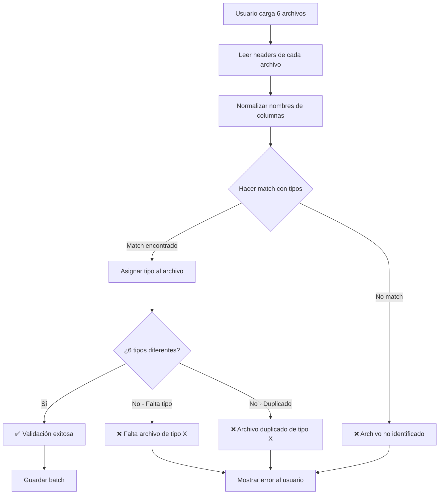

# Estrategia de Validación de Archivos

## Principio Fundamental

**La validación se basa en la estructura de columnas, NO en el nombre del archivo.**

Si un archivo Excel contiene las columnas correctas (nombres y cantidad), será identificado automáticamente como el tipo de archivo correspondiente, sin importar cómo se llame el archivo.

---

## Algoritmo de Validación

### Paso 1: Leer Headers de Todos los Archivos

Cuando el usuario carga 6 archivos, el sistema:
1. Lee la primera fila (headers) de cada archivo
2. Extrae los nombres de columnas
3. Normaliza los nombres (trim, lowercase, sin acentos)

### Paso 2: Matching por Estructura

Para cada archivo cargado, el sistema intenta hacer match con los 6 tipos esperados:

```php
function matchFileType(array $uploadedColumns, array $workflowTypes): ?string
{
    foreach ($workflowTypes as $type) {
        $requiredColumns = $type['required_columns'];
        
        // Verificar si TODAS las columnas requeridas están presentes
        $match = true;
        foreach ($requiredColumns as $requiredCol) {
            if (!in_array(normalize($requiredCol), array_map('normalize', $uploadedColumns))) {
                $match = false;
                break;
            }
        }
        
        if ($match) {
            return $type['name']; // "Turnos", "Reporte_Ventas", etc.
        }
    }
    
    return null; // No se encontró match
}
```

### Paso 3: Validación de Completitud

Después de hacer match de todos los archivos:
- ✅ Verificar que se identificaron exactamente 6 tipos diferentes
- ❌ Error si falta algún tipo
- ❌ Error si hay archivos duplicados (mismo tipo)
- ❌ Error si hay archivos no identificados

---

## Columnas Mínimas Requeridas por Tipo

Basado en el análisis de archivos reales, estas son las columnas **mínimas** que deben estar presentes:

### 1. Turnos
```json
{
  "type": "Turnos",
  "required_columns": [
    "Fecha Apertura",
    "Hs Ap. Caja",
    "Fecha Cierre",
    "Hs Cierre Caja",
    "TURNO",
    "Encargado",
    "APERTURA CAJA Efectivo",
    "Recuento Efectivo"
  ],
  "min_columns": 8
}
```

### 2. Reporte Ventas
```json
{
  "type": "Reporte_Ventas",
  "required_columns": [
    "FechaCierre",
    "Comanda",
    "Total",
    "Propina",
    "Pagos",
    "Boleta",
    "Efectivo",
    "Getnet",
    "Mercado Pago",
    "Cta Cte"
  ],
  "min_columns": 10
}
```

### 3. Reporte Getnet
```json
{
  "type": "Reporte_getnet",
  "required_columns": [
    "Fecha de operacion",
    "Cod de Transaccion",
    "Monto Bruto Transaccion",
    "Arancel",
    "Estado"
  ],
  "min_columns": 5
}
```

### 4. Ventas Mercado Pago
```json
{
  "type": "Ventas_MP",
  "required_columns": [
    "ID DE OPERACIÓN EN MERCADO PAGO",
    "VALOR DE LA COMPRA",
    "MEDIO DE PAGO"
  ],
  "min_columns": 3,
  "aliases": ["Prueba_MP", "Ventas MP", "Ventas_MP"]
}
```

**Nota:** Reducido a 3 columnas clave porque "FECHA DE ORIGEN" puede variar ("FECHA DE ORIGEN (ISO)" vs "FECHA DE ORIGEN")

### 5. Devoluciones
```json
{
  "type": "Devoluciones",
  "required_columns": [
    "ID Comanda",
    "Producto",
    "Precios",
    "Hora pedido",
    "Hora Anulación",
    "Descuadre",
    "DTE Emision"
  ],
  "min_columns": 7
}
```

### 6. Caja Adición
```json
{
  "type": "Caja_Adicion",
  "required_columns": [
    "Fecha Contable",
    "Origen",
    "Proveedor / Para",
    "Monto",
    "Forma de Pago"
  ],
  "min_columns": 5
}
```

**Nota:** Removido "Comentario Toteat POS" porque no existe en archivo real

---

## Normalización de Nombres de Columnas

Para hacer matching robusto, se normalizan los nombres:

```php
function normalize(string $columnName): string
{
    $normalized = strtolower(trim($columnName));
    
    // Remover acentos
    $normalized = str_replace(
        ['á', 'é', 'í', 'ó', 'ú', 'ñ', 'ü'],
        ['a', 'e', 'i', 'o', 'u', 'n', 'u'],
        $normalized
    );
    
    // Remover caracteres especiales excepto espacios y /
    $normalized = preg_replace('/[^a-z0-9\s\/]/', '', $normalized);
    
    return $normalized;
}
```

**Ejemplos:**
- `"Hs Ap. Caja"` → `"hs ap caja"`
- `"Proveedor / Para"` → `"proveedor / para"`
- `"APERTURA CAJA Efectivo"` → `"apertura caja efectivo"`

---

## Flujo de Validación Completo



---

## Ejemplos de Validación

### ✅ Caso Exitoso

**Archivos cargados:**
1. `mi_archivo_turnos.xlsx` → Detectado como "Turnos" (tiene columnas: Fecha Apertura, TURNO, Encargado...)
2. `ventas_enero.xlsx` → Detectado como "Reporte_Ventas" (tiene columnas: FechaCierre, Comanda, Total...)
3. `getnet_data.xlsx` → Detectado como "Reporte_getnet" (tiene columnas: Fecha de operacion, Cod de Transaccion...)
4. `mp_enero.xlsx` → Detectado como "Ventas_MP" (tiene columnas: ID DE OPERACIÓN EN MERCADO PAGO...)
5. `anulaciones.xlsx` → Detectado como "Devoluciones" (tiene columnas: ID Comanda, Producto...)
6. `caja.xlsx` → Detectado como "Caja_Adicion" (tiene columnas: Fecha Contable, Origen...)

**Resultado:** ✅ Validación exitosa - Se identificaron los 6 tipos correctamente

---

### ❌ Caso Error: Archivo Faltante

**Archivos cargados:** Solo 5 archivos

**Resultado:** ❌ Error: "Faltan archivos. Se requieren 6 archivos pero se cargaron 5."

---

### ❌ Caso Error: Archivo No Identificado

**Archivos cargados:**
1-5. (Correctos)
6. `random_data.xlsx` → No match con ningún tipo (columnas no coinciden)

**Resultado:** ❌ Error: "El archivo 'random_data.xlsx' no pudo ser identificado. Verifique que contenga las columnas correctas."

---

### ❌ Caso Error: Archivo Duplicado

**Archivos cargados:**
1. `turnos_enero.xlsx` → Detectado como "Turnos"
2. `turnos_febrero.xlsx` → Detectado como "Turnos" ⚠️
3-6. (Otros tipos correctos)

**Resultado:** ❌ Error: "Se detectaron 2 archivos del tipo 'Turnos'. Solo se permite uno de cada tipo."

---

## Ventajas de Esta Estrategia

1. **Flexibilidad:** El usuario puede nombrar los archivos como quiera
2. **Robustez:** Detecta automáticamente el tipo correcto
3. **Validación Estricta:** Asegura que todos los tipos estén presentes
4. **Prevención de Errores:** Detecta duplicados y archivos incorrectos
5. **Experiencia de Usuario:** Mensajes de error claros y específicos

---

## Implementación en Código

### FileValidationService

```php
class FileValidationService
{
    protected function getRequiredFileTypes(): array
    {
        return [
            [
                'name' => 'Turnos',
                'required_columns' => ['Fecha Apertura', 'Hs Ap. Caja', 'Fecha Cierre', 'Hs Cierre Caja', 'TURNO', 'Encargado', 'APERTURA CAJA Efectivo', 'Recuento Efectivo']
            ],
            [
                'name' => 'Reporte_Ventas',
                'required_columns' => ['FechaCierre', 'Comanda', 'Total', 'Propina', 'Pagos', 'Boleta', 'Efectivo', 'Getnet', 'Mercado Pago', 'Cta Cte']
            ],
            [
                'name' => 'Reporte_getnet',
                'required_columns' => ['Fecha de operacion', 'Cod de Transaccion', 'Monto Bruto Transaccion', 'Arancel', 'Estado']
            ],
            [
                'name' => 'Ventas_MP',
                'required_columns' => ['ID DE OPERACIÓN EN MERCADO PAGO', 'VALOR DE LA COMPRA', 'MEDIO DE PAGO']
            ],
            [
                'name' => 'Devoluciones',
                'required_columns' => ['ID Comanda', 'Producto', 'Precios', 'Hora pedido', 'Hora Anulación', 'Descuadre', 'DTE Emision']
            ],
            [
                'name' => 'Caja_Adicion',
                'required_columns' => ['Fecha Contable', 'Origen', 'Proveedor / Para', 'Monto', 'Forma de Pago']
            ]
        ];
    }
    
    public function validateBatch(array $uploadedFiles): array
    {
        $results = [
            'valid' => true,
            'matched_files' => [],
            'errors' => []
        ];
        
        $requiredTypes = $this->getRequiredFileTypes();
        $matchedTypes = [];
        
        foreach ($uploadedFiles as $file) {
            $columns = $this->extractColumns($file);
            $matchedType = $this->matchFileType($columns, $requiredTypes);
            
            if (!$matchedType) {
                $results['valid'] = false;
                $results['errors'][] = "Archivo '{$file->getClientOriginalName()}' no identificado";
                continue;
            }
            
            if (in_array($matchedType, $matchedTypes)) {
                $results['valid'] = false;
                $results['errors'][] = "Archivo duplicado del tipo '{$matchedType}'";
                continue;
            }
            
            $matchedTypes[] = $matchedType;
            $results['matched_files'][] = [
                'filename' => $file->getClientOriginalName(),
                'type' => $matchedType,
                'columns' => $columns
            ];
        }
        
        // Verificar que se identificaron los 6 tipos
        if (count($matchedTypes) < 6) {
            $results['valid'] = false;
            $missing = array_diff(
                array_column($requiredTypes, 'name'),
                $matchedTypes
            );
            $results['errors'][] = "Faltan archivos de tipo: " . implode(', ', $missing);
        }
        
        return $results;
    }
}
```

---

## Interfaz de Usuario

### Checklist Visual Durante Carga

```
📁 Validación de Archivos

✅ Cantidad correcta: 6/6 archivos
✅ Todos los tipos identificados

Archivos detectados:
✅ Turnos (mi_turnos.xlsx)
✅ Reporte Ventas (ventas.xlsx)
✅ Reporte Getnet (getnet.xlsx)
✅ Ventas Mercado Pago (mp.xlsx)
✅ Devoluciones (dev.xlsx)
✅ Caja Adición (caja.xlsx)
```

### Mensaje de Error

```
❌ Error en Validación

Problemas detectados:
• El archivo 'datos.xlsx' no pudo ser identificado
• Falta archivo de tipo: Turnos

Por favor verifique que:
1. Todos los archivos tengan las columnas correctas
2. Se carguen exactamente 6 archivos
3. No haya archivos duplicados
```
