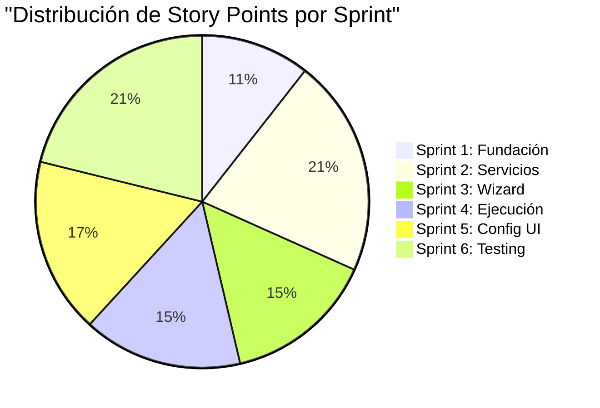
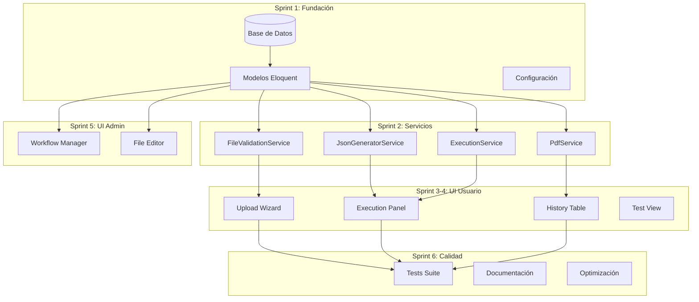
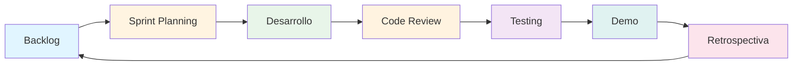

# Roadmap Visual: Sistema de Workflows

## 🗓️ Timeline General

```
Enero 2026          Febrero 2026         Marzo 2026
│                   │                    │
├─ Sprint 1 ────────┤                    │
│  Fundación        │                    │
│                   │                    │
                    ├─ Sprint 2 ─────────┤
                    │  Servicios         │
                    │                    │
                                         ├─ Sprint 3 ────────┤
                                         │  Wizard            │
                                         │                    │
                                                              ├─ Sprint 4 ────────┤
                                                              │  Ejecución         │
                                                              │                    │
                                                                                   ├─ Sprint 5 ────────┤
                                                                                   │  Config UI         │
                                                                                   │                    │
                                                                                                        ├─ Sprint 6 ────────┤
                                                                                                        │  Testing           │
                                                                                                        │                    │
                                                                                                                             └─ RELEASE
```

---

## 📊 Distribución de Esfuerzo



**Total Story Points:** 123

---

## 🎯 Progreso por Hitos

```mermaid
gantt
    title Hitos del Proyecto Workflows
    dateFormat YYYY-MM-DD
    section Hitos
    M1: Base de Datos           :milestone, m1, 2026-01-15, 0d
    M2: Servicios Core          :milestone, m2, 2026-01-29, 0d
    M3: MVP Funcional           :milestone, m3, 2026-02-12, 0d
    M4: Historial               :milestone, m4, 2026-02-26, 0d
    M5: Configuración           :milestone, m5, 2026-03-12, 0d
    M6: Producción              :milestone, m6, 2026-03-26, 0d
    
    section Sprints
    Sprint 1: Fundación         :s1, 2026-01-01, 14d
    Sprint 2: Servicios         :s2, after s1, 14d
    Sprint 3: Wizard            :s3, after s2, 14d
    Sprint 4: Ejecución         :s4, after s3, 14d
    Sprint 5: Config UI         :s5, after s4, 14d
    Sprint 6: Testing           :s6, after s5, 14d
```

---

## 🏗️ Arquitectura por Capas



---

## 📈 Velocity Estimada

| Sprint | Story Points | Días | Velocity Diaria |
|--------|--------------|------|-----------------|
| Sprint 1 | 13 | 10 | 1.3 |
| Sprint 2 | 26 | 10 | 2.6 |
| Sprint 3 | 18 | 10 | 1.8 |
| Sprint 4 | 19 | 10 | 1.9 |
| Sprint 5 | 21 | 10 | 2.1 |
| Sprint 6 | 26 | 10 | 2.6 |

**Promedio:** 2.05 story points/día

---

## 🎨 Entregables por Sprint

### Sprint 1: Fundación ✅
```
📦 Entregables:
├── 6 migraciones de BD
├── 6 modelos Eloquent
├── 1 seeder (Conciliación)
└── 1 archivo de configuración
```

### Sprint 2: Servicios 🔧
```
📦 Entregables:
├── FileValidationService
├── WorkflowJsonGeneratorService
├── WorkflowExecutionService
├── WorkflowPdfService
└── Tests unitarios (>80% coverage)
```

### Sprint 3: Wizard 🎨
```
📦 Entregables:
├── WorkflowFileUploadWizard (Livewire)
│   ├── Paso 1: Cliente/Sede
│   ├── Paso 2: Workflow Type
│   ├── Paso 3: Carga archivos
│   └── Paso 4: Confirmación
└── Vista Blade con diseño premium
```

### Sprint 4: Ejecución ⚙️
```
📦 Entregables:
├── WorkflowExecutionPanel (Livewire)
├── WorkflowHistoryTable (Livewire)
├── Vista /test
└── Descarga de PDF
```

### Sprint 5: Config UI 🔧
```
📦 Entregables:
├── WorkflowTypeManager (Livewire)
├── FileDefinitionEditor (Livewire)
└── CRUD completo de configuración
```

### Sprint 6: Testing ✅
```
📦 Entregables:
├── Suite de tests completa
├── Optimizaciones de performance
├── Documentación completa
└── Sistema listo para producción
```

---

## 🚦 Criterios de Avance

### ✅ Sprint Completado
- Todas las historias de usuario completadas
- Tests pasando
- Code review aprobado
- Documentación actualizada
- Demo funcional

### ⚠️ Sprint En Riesgo
- >20% de story points sin completar
- Tests fallando
- Bloqueadores sin resolver
- Deuda técnica acumulándose

### 🔴 Sprint Bloqueado
- Dependencias externas no disponibles
- Bugs críticos sin resolver
- Recursos no disponibles

---

## 🎯 Checklist de Inicio de Sprint

Antes de comenzar cada sprint:

- [ ] Backlog refinado
- [ ] Historias estimadas
- [ ] Criterios de aceptación claros
- [ ] Dependencias identificadas
- [ ] Equipo disponible
- [ ] Ambiente de desarrollo listo

---

## 📋 Checklist de Fin de Sprint

Al finalizar cada sprint:

- [ ] Todas las historias completadas o movidas
- [ ] Tests pasando
- [ ] Code review completado
- [ ] Documentación actualizada
- [ ] Demo realizada
- [ ] Retrospectiva completada
- [ ] Próximo sprint planificado

---

## 🔄 Flujo de Trabajo



---

## 📞 Ceremonias Ágiles

| Ceremonia | Frecuencia | Duración | Participantes |
|-----------|------------|----------|---------------|
| **Daily Standup** | Diario | 15 min | Equipo dev |
| **Sprint Planning** | Inicio de sprint | 2 horas | Todo el equipo |
| **Sprint Review** | Fin de sprint | 1 hora | Equipo + stakeholders |
| **Retrospectiva** | Fin de sprint | 1 hora | Equipo dev |
| **Backlog Refinement** | Semanal | 1 hora | PO + dev leads |

---

**Última actualización:** 2026-01-03  
**Versión:** 1.0.0
