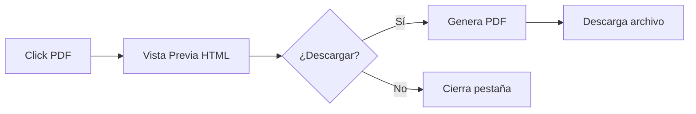
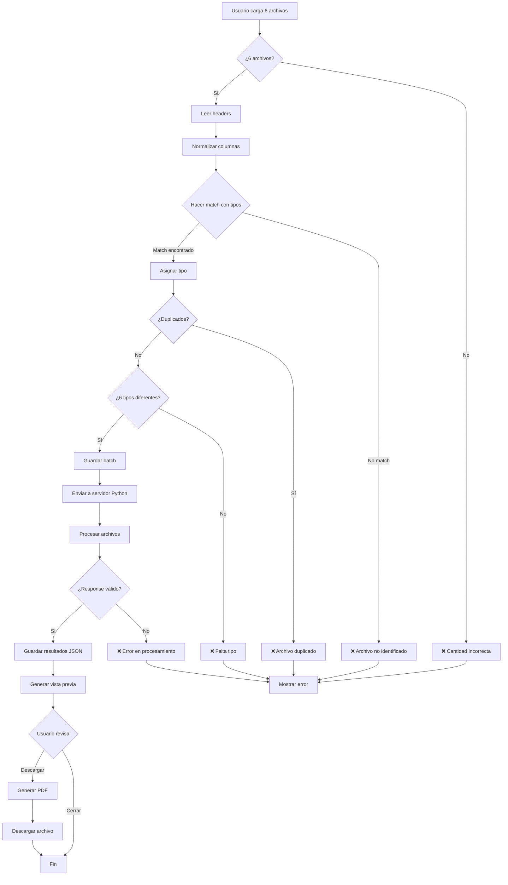

# Estrategia de Validación de Workflows

## Visión General

El sistema de workflows implementa una estrategia de validación en **3 fases**:

1. **Validación de Archivos** - Verificar estructura y tipos de archivos
2. **Ejecución del Workflow** - Procesamiento por servidor Python
3. **Generación de Reportes** - Vista previa y descarga de PDFs

---

## Fase 1: Validación de Archivos

### Principio Fundamental

**La validación se basa en la estructura de columnas, NO en el nombre del archivo.**

Si un archivo Excel contiene las columnas correctas (nombres y cantidad), será identificado automáticamente como el tipo de archivo correspondiente, sin importar cómo se llame el archivo.

### Algoritmo de Validación

#### Paso 1: Leer Headers de Todos los Archivos

Cuando el usuario carga 6 archivos, el sistema:
1. Lee la primera fila (headers) de cada archivo
2. Extrae los nombres de columnas
3. Normaliza los nombres (trim, lowercase, sin acentos)

#### Paso 2: Matching por Estructura

Para cada archivo cargado, el sistema intenta hacer match con los 6 tipos esperados:

```php
function matchFileType(array $uploadedColumns, array $workflowTypes): ?string
{
    foreach ($workflowTypes as $type) {
        $requiredColumns = $type['required_columns'];
        
        // Verificar si TODAS las columnas requeridas están presentes
        $match = true;
        foreach ($requiredColumns as $requiredCol) {
            if (!in_array(normalize($requiredCol), array_map('normalize', $uploadedColumns))) {
                $match = false;
                break;
            }
        }
        
        if ($match) {
            return $type['name']; // "Turnos", "Reporte_Ventas", etc.
        }
    }
    
    return null; // No se encontró match
}
```

#### Paso 3: Validación de Completitud

Después de hacer match de todos los archivos:
- ✅ Verificar que se identificaron exactamente 6 tipos diferentes
- ❌ Error si falta algún tipo
- ❌ Error si hay archivos duplicados (mismo tipo)
- ❌ Error si hay archivos no identificados

### Columnas Mínimas Requeridas por Tipo

#### 1. Turnos
```json
{
  "type": "Turnos",
  "required_columns": [
    "Fecha Apertura",
    "Hs Ap. Caja",
    "Fecha Cierre",
    "Hs Cierre Caja",
    "TURNO",
    "Encargado",
    "APERTURA CAJA Efectivo",
    "Recuento Efectivo"
  ],
  "min_columns": 8
}
```

#### 2. Reporte Ventas
```json
{
  "type": "Reporte_Ventas",
  "required_columns": [
    "FechaCierre",
    "Comanda",
    "Total",
    "Propina",
    "Pagos",
    "Boleta",
    "Efectivo",
    "Getnet",
    "Mercado Pago",
    "Cta Cte"
  ],
  "min_columns": 10
}
```

#### 3. Reporte Getnet
```json
{
  "type": "Reporte_getnet",
  "required_columns": [
    "Fecha de operacion",
    "Cod de Transaccion",
    "Monto Bruto Transaccion",
    "Arancel",
    "Estado"
  ],
  "min_columns": 5
}
```

#### 4. Ventas Mercado Pago
```json
{
  "type": "Ventas_MP",
  "required_columns": [
    "ID DE OPERACIÓN EN MERCADO PAGO",
    "VALOR DE LA COMPRA",
    "MEDIO DE PAGO"
  ],
  "min_columns": 3
}
```

#### 5. Devoluciones
```json
{
  "type": "Devoluciones",
  "required_columns": [
    "ID Comanda",
    "Producto",
    "Precios",
    "Hora pedido",
    "Hora Anulación",
    "Descuadre",
    "DTE Emision"
  ],
  "min_columns": 7
}
```

#### 6. Caja Adición
```json
{
  "type": "Caja_Adicion",
  "required_columns": [
    "Fecha Contable",
    "Origen",
    "Proveedor / Para",
    "Monto",
    "Forma de Pago"
  ],
  "min_columns": 5
}
```

### Normalización de Nombres de Columnas

Para hacer matching robusto, se normalizan los nombres:

```php
function normalize(string $columnName): string
{
    $normalized = strtolower(trim($columnName));
    
    // Remover acentos
    $normalized = str_replace(
        ['á', 'é', 'í', 'ó', 'ú', 'ñ', 'ü'],
        ['a', 'e', 'i', 'o', 'u', 'n', 'u'],
        $normalized
    );
    
    // Remover caracteres especiales excepto espacios y /
    $normalized = preg_replace('/[^a-z0-9\\s\\/]/', '', $normalized);
    
    return $normalized;
}
```

**Ejemplos:**
- `"Hs Ap. Caja"` → `"hs ap caja"`
- `"Proveedor / Para"` → `"proveedor / para"`
- `"APERTURA CAJA Efectivo"` → `"apertura caja efectivo"`

---

## Fase 2: Ejecución del Workflow

### Integración con Servidor Python

Una vez validados los archivos, Laravel envía los datos al servidor Python para procesamiento.

#### Request a Servidor Python

```json
{
  "workflow_type": "conciliacion",
  "batch_id": 14,
  "files": [
    {
      "type": "caja_adicion",
      "path": "/storage/workflows/batch_14/caja_adicion.xlsx"
    },
    {
      "type": "reporte_ventas",
      "path": "/storage/workflows/batch_14/reporte_ventas.xlsx"
    },
    {
      "type": "reporte_getnet",
      "path": "/storage/workflows/batch_14/reporte_getnet.xlsx"
    },
    {
      "type": "ventas_mp",
      "path": "/storage/workflows/batch_14/ventas_mp.xlsx"
    },
    {
      "type": "turnos",
      "path": "/storage/workflows/batch_14/turnos.xlsx"
    },
    {
      "type": "devoluciones",
      "path": "/storage/workflows/batch_14/devoluciones.xlsx"
    }
  ],
  "client_id": 1,
  "branch_id": 2
}
```

#### Response Esperado del Servidor Python

```json
{
  "success": true,
  "execution_time_ms": 1250,
  "data": {
    "metadata": {
      "fecha": "12/02/2025",
      "dia": "Martes",
      "turno": "MAÑANA",
      "encargado": "Felipe",
      "hs_apertura": "11:10",
      "hs_cierre": "20:19",
      "sucursal": "PARADOR"
    },
    "enviar_sucursal": { ... },
    "enviar_egresos": { ... },
    "enviar_no_conciliados": { ... },
    "enviar_anulaciones": [ ... ]
  }
}
```

### Validación de Response

Laravel valida que el response del servidor Python contenga:

1. ✅ Campo `success` = true
2. ✅ Campo `data` con estructura completa
3. ✅ Todos los campos obligatorios presentes
4. ❌ Error si `success` = false
5. ❌ Error si faltan campos requeridos

### Almacenamiento de Resultados

El JSON completo se almacena en:
- **Tabla:** `workflow_executions`
- **Campo:** `response_data` (JSON)
- **Uso:** Generación de PDFs y reportes

---

## Fase 3: Generación de Reportes

### Sistema de Vista Previa

El sistema implementa un flujo de **vista previa antes de descargar**:



### Componentes del Sistema

#### 1. Vista Previa HTML
- **Ruta:** `/programadores/workflows/execution/{id}/pdf/preview`
- **Vista:** `workflow-conciliacion-preview.blade.php`
- **Características:**
  - Diseño que replica Google Sheets
  - Colores corporativos (#1f3864, #bdbdbd)
  - Botón de descarga prominente
  - Responsive

#### 2. Generación de PDF
- **Ruta:** `/programadores/workflows/execution/{id}/pdf/download`
- **Vista:** `workflow-conciliacion-pdf.blade.php`
- **Tecnología:** DomPDF
- **Formato:** A4 vertical
- **Características:**
  - Optimizado para PDF
  - Saltos de página apropiados
  - Fuente DejaVu Sans

### Secciones del Reporte

El PDF generado incluye:

1. **Enviar Sucursal**
   - Metadata (fecha, turno, encargado)
   - Estadísticas del parador
   - Horarios de venta
   - Total de ventas

2. **Diferencias de Caja**
   - Mercado Pago (real vs sistema)
   - Getnet (real vs sistema)
   - Efectivo (apertura, recuento, diferencia)
   - Cuenta Corriente

3. **Enviar Egresos**
   - Egresos de Caja Adición
   - Egresos de Mercado Pago

4. **Enviar No Conciliados**
   - Mercado Pago no conciliados
   - Getnet no conciliados
   - Efectivo y Cta Cte no conciliados

5. **Enviar Anulaciones**
   - Listado de productos anulados
   - Detalles de cada anulación

---

## Flujo Completo de Validación



---

## Casos de Uso

### ✅ Caso Exitoso Completo

**Paso 1: Carga de Archivos**
```
Usuario carga:
1. mi_turnos.xlsx → Detectado como "Turnos"
2. ventas.xlsx → Detectado como "Reporte_Ventas"
3. getnet.xlsx → Detectado como "Reporte_getnet"
4. mp.xlsx → Detectado como "Ventas_MP"
5. dev.xlsx → Detectado como "Devoluciones"
6. caja.xlsx → Detectado como "Caja_Adicion"

✅ Validación exitosa
```

**Paso 2: Procesamiento**
```
Laravel → Servidor Python
Servidor Python procesa archivos
Servidor Python → Laravel (JSON con resultados)
✅ Resultados guardados
```

**Paso 3: Visualización**
```
Usuario click "PDF"
→ Vista previa HTML se abre
Usuario revisa datos
Usuario click "Descargar PDF"
→ PDF se genera y descarga
✅ Proceso completado
```

### ❌ Caso Error: Archivo No Identificado

**Archivos cargados:**
```
1-5. (Correctos)
6. random_data.xlsx → No match (columnas incorrectas)
```

**Resultado:**
```
❌ Error en Validación

El archivo 'random_data.xlsx' no pudo ser identificado.

Verifique que contenga las columnas correctas para uno de estos tipos:
• Turnos
• Reporte Ventas
• Reporte Getnet
• Ventas Mercado Pago
• Devoluciones
• Caja Adición
```

### ❌ Caso Error: Servidor Python Falla

**Escenario:**
```
Archivos validados correctamente
Enviados a servidor Python
Servidor Python retorna error
```

**Response del servidor:**
```json
{
  "success": false,
  "error": {
    "code": "VALIDATION_ERROR",
    "message": "El archivo de ventas MP está corrupto",
    "details": "Error en línea 45: formato de fecha inválido"
  }
}
```

**Resultado en Laravel:**
```
❌ Error en Procesamiento

El servidor reportó un error:
"El archivo de ventas MP está corrupto"

Detalles: Error en línea 45: formato de fecha inválido

Por favor corrija el archivo y vuelva a intentar.
```

---

## Implementación Técnica

### Archivos Clave

#### Backend
- `WorkflowFileUploadWizard.php` - Wizard de carga de archivos
- `WorkflowBatchController.php` - Controlador de batches
- `WorkflowPdfController.php` - Controlador de PDFs
- `WorkflowMockService.php` - Servicio mock para pruebas

#### Vistas
- `workflow-conciliacion-preview.blade.php` - Vista previa HTML
- `workflow-conciliacion-pdf.blade.php` - Template para PDF

#### Documentación
- `API_CONTRACT.md` - Contrato de API con servidor Python
- `workflow_data_structure.json` - Estructura JSON de ejemplo

### Rutas

```php
// Vista previa
GET /programadores/workflows/execution/{id}/pdf/preview

// Descarga PDF
GET /programadores/workflows/execution/{id}/pdf/download

// Historial
GET /programadores/workflows/history
```

---

## Ventajas del Sistema

1. **Validación Robusta** - Detecta errores antes de procesar
2. **Flexibilidad** - Nombres de archivo libres
3. **Integración Clara** - Contrato bien definido con Python
4. **UX Mejorada** - Vista previa antes de descargar
5. **Trazabilidad** - Todos los resultados almacenados
6. **Escalabilidad** - Fácil agregar nuevos tipos de workflow

---

## Próximos Pasos

### Cuando el Servidor Python esté Listo

1. **Configurar endpoint** en `.env`:
   ```
   PYTHON_WORKFLOW_URL=http://python-server:5000/api/workflow/execute
   ```

2. **Reemplazar mock** en `WorkflowPdfController.php`:
   ```php
   // Cambiar:
   $data = WorkflowMockService::getMockConciliacionData();
   
   // Por:
   $data = json_decode($execution->response_data, true);
   ```

3. **Probar integración** con archivos reales

4. **Validar resultados** en vista previa

5. **Desplegar a producción**

---

## Referencias

- [API Contract](file:///d:/Front-Api/docs/Desarrollos/pdf_preferencias/API_CONTRACT.md) - Documentación completa del contrato de API
- [Estructura JSON](file:///d:/Front-Api/docs/Desarrollos/pdf_preferencias/workflow_data_structure.json) - Ejemplo de estructura de datos
- [Walkthrough](file:///C:/Users/Omar%20Olivera/.gemini/antigravity/brain/a46dda0f-6db5-47f7-a799-59fba905dfed/walkthrough.md) - Guía de implementación del sistema de PDFs
