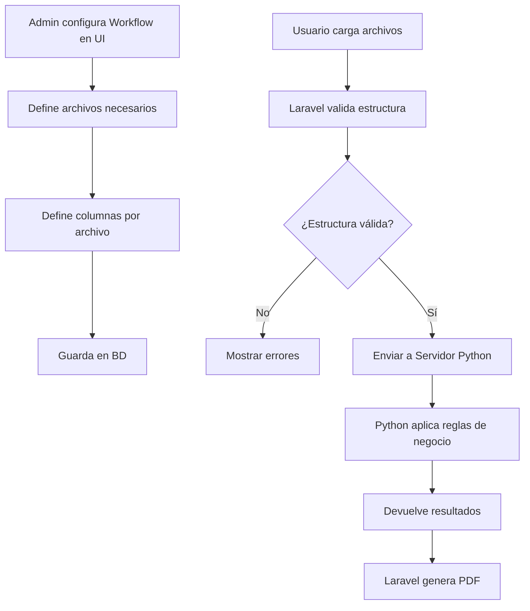
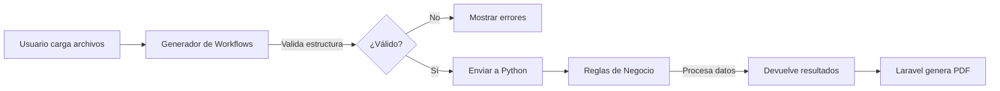

# Sistema Configurable de Workflows

## Análisis: ¿Generador de Workflows vs Reglas de Negocio?

### Diferencias Clave

| Aspecto | Generador de Workflows | Reglas de Negocio |
|---------|----------------------|-------------------|
| **Propósito** | Definir QUÉ archivos y columnas se necesitan | Definir CÓMO procesar los datos |
| **Responsable** | Laravel (validación estructural) | Servidor Python (lógica de negocio) |
| **Salida** | Validación de archivos | JSON con resultados calculados |
| **Complejidad** | Configuración simple | Lógica compleja de negocio |
| **Usuarios** | Programadores/Admins | Desarrolladores Python |

### Recomendación: **SON SISTEMAS SEPARADOS**

✅ **Generador de Workflows** (Laravel)
- Define estructura de archivos
- Valida columnas presentes
- Configurable desde UI
- **NO ejecuta lógica de negocio**

✅ **Reglas de Negocio** (Servidor Python)
- Recibe datos validados
- Aplica cálculos y lógica
- Genera resultados
- **NO se preocupa por validación estructural**

---

## Concepto del Sistema

El sistema permite configurar workflows **sin tocar código**, definiendo:

1. ✅ Tipos de workflows disponibles
2. ✅ Archivos requeridos por workflow
3. ✅ Columnas necesarias por archivo
4. ✅ Columnas obligatorias vs opcionales
5. ✅ Todo desde interfaz web

### Flujo Completo



---

## Arquitectura de Base de Datos

### Tabla: `workflow_types`

Define los tipos de workflows disponibles:

```php
Schema::create('workflow_types', function (Blueprint $table) {
    $table->id();
    $table->string('name')->unique(); // "Conciliación", "Inventario"
    $table->string('slug')->unique(); // "conciliacion", "inventario"
    $table->text('description')->nullable();
    $table->boolean('is_active')->default(true);
    $table->string('python_endpoint')->nullable(); // URL del servidor Python
    $table->timestamps();
});
```

### Tabla: `workflow_file_definitions`

Define qué archivos se esperan para cada workflow:

```php
Schema::create('workflow_file_definitions', function (Blueprint $table) {
    $table->id();
    $table->foreignId('workflow_type_id')->constrained()->onDelete('cascade');
    $table->string('file_key'); // "turnos", "reporte_ventas"
    $table->string('display_name'); // "Turnos", "Reporte de Ventas"
    $table->text('description')->nullable();
    $table->integer('order')->default(0);
    $table->boolean('is_required')->default(true);
    $table->timestamps();
    
    $table->unique(['workflow_type_id', 'file_key']);
});
```

### Tabla: `workflow_required_columns`

Define las columnas requeridas para cada archivo:

```php
Schema::create('workflow_required_columns', function (Blueprint $table) {
    $table->id();
    $table->foreignId('file_definition_id')
        ->constrained('workflow_file_definitions')
        ->onDelete('cascade');
    $table->string('column_name'); // "Fecha Apertura"
    $table->string('column_name_normalized'); // "fecha apertura"
    $table->boolean('is_required')->default(true);
    $table->integer('order')->default(0);
    $table->text('description')->nullable();
    $table->enum('data_type', ['string', 'number', 'date', 'boolean'])->nullable();
    $table->timestamps();
});
```

---

## Interfaz de Administración

### Vista Principal: Gestión de Workflows

**Ruta:** `/admin/workflows/generator`

```
┌─────────────────────────────────────────────────────────────┐
│ 🔧 Generador de Workflows                                   │
├─────────────────────────────────────────────────────────────┤
│                                                              │
│ [+ Crear Nuevo Workflow]                                    │
│                                                              │
│ ▼ Conciliación                          ✅ Activo [Editar] │
│   Descripción: Conciliación de datos financieros            │
│   Servidor Python: http://python:5000/api/workflow/execute │
│   Archivos requeridos: 6                                     │
│                                                              │
│   ┌──────────────────────────────────────────────┐          │
│   │ 📄 Turnos (8 columnas)          [Editar]    │          │
│   │ 📄 Reporte Ventas (10 columnas) [Editar]    │          │
│   │ 📄 Reporte Getnet (5 columnas)  [Editar]    │          │
│   │ 📄 Ventas MP (3 columnas)       [Editar]    │          │
│   │ 📄 Devoluciones (7 columnas)    [Editar]    │          │
│   │ 📄 Caja Adición (5 columnas)    [Editar]    │          │
│   │                                               │          │
│   │ [+ Agregar Archivo]                          │          │
│   └──────────────────────────────────────────────┘          │
│                                                              │
│ ▶ Inventario                            ⚪ Inactivo         │
│   (Click para expandir)                                      │
│                                                              │
└─────────────────────────────────────────────────────────────┘
```

### Editor de Archivo

**Ruta:** `/admin/workflows/generator/{workflow}/files/{file}/edit`

```
┌─────────────────────────────────────────────────────────────┐
│ ✏️ Editar Definición: Turnos (Conciliación)                 │
├─────────────────────────────────────────────────────────────┤
│                                                              │
│ Clave del archivo: [turnos                ]                │
│ Nombre visible:    [Turnos                ]                │
│ Descripción:       [Archivo de turnos de caja]             │
│ ☑️ Archivo obligatorio                                       │
│                                                              │
│ ── Columnas Requeridas ──────────────────────────────────   │
│                                                              │
│ 1. ✅ Fecha Apertura                                         │
│    Tipo: Fecha          Obligatoria ☑️    [🗑️]             │
│                                                              │
│ 2. ✅ Hs Ap. Caja                                            │
│    Tipo: Texto          Obligatoria ☑️    [🗑️]             │
│                                                              │
│ 3. ✅ Fecha Cierre                                           │
│    Tipo: Fecha          Obligatoria ☑️    [🗑️]             │
│                                                              │
│ 4. ✅ TURNO                                                  │
│    Tipo: Número         Obligatoria ☑️    [🗑️]             │
│                                                              │
│ 5. ✅ Encargado                                              │
│    Tipo: Texto          Obligatoria ☑️    [🗑️]             │
│                                                              │
│ 6. ⚪ Supervisor                                             │
│    Tipo: Texto          Opcional ☐        [🗑️]             │
│    Desc: Supervisor del turno (si aplica)                   │
│                                                              │
│ [+ Agregar Columna]                                         │
│                                                              │
│ ┌────────────────────────────────────────────┐              │
│ │ 💡 Tip: Las columnas obligatorias deben   │              │
│ │ estar presentes para validación exitosa.  │              │
│ └────────────────────────────────────────────┘              │
│                                                              │
│ [Cancelar]                          [Guardar Cambios]       │
└─────────────────────────────────────────────────────────────┘
```

---

## Integración con Sistema Actual

### 1. Wizard de Carga

El wizard debe consultar workflows disponibles:

```php
// WorkflowFileUploadWizard.php
public function mount()
{
    // Cargar workflows activos desde BD
    $this->availableWorkflows = WorkflowType::where('is_active', true)
        ->with('fileDefinitions.requiredColumns')
        ->get();
}

public function selectWorkflow($workflowId)
{
    $this->selectedWorkflow = WorkflowType::with('fileDefinitions.requiredColumns')
        ->findOrFail($workflowId);
    
    // Mostrar archivos requeridos dinámicamente
    $this->requiredFiles = $this->selectedWorkflow->fileDefinitions()
        ->where('is_required', true)
        ->get();
}
```

### 2. Validación Dinámica

```php
// FileValidationService.php
public function validateBatch(WorkflowType $workflowType, array $uploadedFiles): array
{
    $fileDefinitions = $workflowType->fileDefinitions()
        ->with('requiredColumns')
        ->where('is_required', true)
        ->get();
    
    $results = [
        'valid' => true,
        'matched_files' => [],
        'errors' => []
    ];
    
    foreach ($uploadedFiles as $file) {
        $columns = $this->extractColumns($file);
        $matchedDef = $this->matchFileDefinition($columns, $fileDefinitions);
        
        if (!$matchedDef) {
            $results['valid'] = false;
            $results['errors'][] = "Archivo no identificado: {$file->getClientOriginalName()}";
            continue;
        }
        
        // Validar columnas obligatorias
        $missingColumns = $this->checkRequiredColumns($columns, $matchedDef);
        if (!empty($missingColumns)) {
            $results['valid'] = false;
            $results['errors'][] = "Faltan columnas en {$matchedDef->display_name}: " . implode(', ', $missingColumns);
        }
    }
    
    return $results;
}
```

### 3. Envío a Servidor Python

```php
// WorkflowExecutionService.php
public function executeWorkflow(WorkflowFileBatch $batch): WorkflowExecution
{
    $workflowType = $batch->workflowType;
    
    // Preparar datos para Python
    $payload = [
        'workflow_type' => $workflowType->slug,
        'batch_id' => $batch->id,
        'files' => $this->prepareFilesData($batch),
        'client' => [
            'id' => $batch->client_id,
            'company' => $batch->client->company
        ]
    ];
    
    // Llamar al endpoint configurado
    $response = Http::post($workflowType->python_endpoint, $payload);
    
    // Guardar respuesta
    $execution = WorkflowExecution::create([
        'file_batch_id' => $batch->id,
        'executed_by' => auth()->id(),
        'status' => $response->successful() ? 'success' : 'failed',
        'response_data' => $response->json()
    ]);
    
    return $execution;
}
```

---

## Casos de Uso

### Caso 1: Crear Workflow "Inventario"

**Pasos:**

1. Ir a `/admin/workflows/generator`
2. Click "Crear Nuevo Workflow"
3. Completar:
   - Nombre: "Inventario"
   - Slug: "inventario"
   - Descripción: "Control mensual de inventario"
   - Endpoint Python: `http://python:5000/api/workflow/inventario`
4. Guardar

5. Agregar archivos:
   - **Stock Actual**
     - Columnas: Código, Producto, Cantidad, Ubicación
   - **Movimientos**
     - Columnas: Fecha, Tipo, Código, Cantidad
   - **Ajustes**
     - Columnas: Código, Cantidad_Anterior, Cantidad_Nueva, Motivo

6. Guardar configuración

**Resultado:** El workflow "Inventario" aparece en el wizard de carga

**Tiempo:** 15-20 minutos

---

### Caso 2: Agregar Columna a Workflow Existente

**Situación:** Necesitas validar "Supervisor" en Turnos

**Pasos:**

1. Ir a `/admin/workflows/generator`
2. Expandir "Conciliación"
3. Click "Editar" en "Turnos"
4. Click "+ Agregar Columna"
5. Completar:
   - Nombre: "Supervisor"
   - Tipo: Texto
   - ☑️ Obligatoria
   - Descripción: "Supervisor del turno"
6. Guardar

**Resultado:** Próximas cargas validarán la columna "Supervisor"

**Tiempo:** 2 minutos

---

### Caso 3: Hacer Columna Opcional

**Situación:** "Cantidad de comensales" no siempre está presente

**Pasos:**

1. Editar "Turnos"
2. Encontrar "Cantidad de comensales"
3. Desmarcar "Obligatoria"
4. Guardar

**Resultado:** El archivo es válido con o sin esta columna

**Tiempo:** 1 minuto

---

## Diferencia con Reglas de Negocio

### Generador de Workflows (Este Sistema)

```
Responsabilidad: VALIDACIÓN ESTRUCTURAL

Input:  Archivos Excel cargados
Output: ✅ Archivos válidos / ❌ Errores de estructura

Ejemplo:
- ✅ "Turnos.xlsx tiene todas las columnas requeridas"
- ❌ "Falta columna 'Encargado' en Turnos.xlsx"
```

### Reglas de Negocio (Servidor Python)

```
Responsabilidad: LÓGICA DE NEGOCIO

Input:  JSON con datos validados
Output: JSON con resultados calculados

Ejemplo:
- Calcular diferencias de caja
- Detectar descuadres
- Generar estadísticas
- Aplicar fórmulas complejas
```

### Separación Clara



---

## Implementación Recomendada

### Fase 1: Migración de Datos (Actual → Configurable)

```php
// Migrar configuración hardcodeada a BD
public function migrateCurrentWorkflow()
{
    $conciliacion = WorkflowType::create([
        'name' => 'Conciliación',
        'slug' => 'conciliacion',
        'description' => 'Conciliación de datos financieros',
        'python_endpoint' => env('PYTHON_WORKFLOW_URL'),
        'is_active' => true
    ]);
    
    // Migrar definiciones de archivos actuales
    $this->migrateFileDefinitions($conciliacion);
}
```

### Fase 2: Interfaz de Administración

```php
// Livewire Component
class WorkflowGenerator extends Component
{
    public $workflows;
    public $selectedWorkflow;
    
    public function mount()
    {
        $this->workflows = WorkflowType::with('fileDefinitions')->get();
    }
    
    public function createWorkflow()
    {
        // Modal para crear workflow
    }
    
    public function editWorkflow($workflowId)
    {
        $this->selectedWorkflow = WorkflowType::find($workflowId);
    }
}
```

### Fase 3: Validación Dinámica

```php
// Actualizar FileValidationService
public function validateBatch(WorkflowFileBatch $batch): array
{
    $workflowType = $batch->workflowType;
    
    // Cargar configuración desde BD
    $fileDefinitions = $workflowType->fileDefinitions()
        ->with('requiredColumns')
        ->get();
    
    // Validar dinámicamente
    return $this->validateAgainstDefinitions($batch->files, $fileDefinitions);
}
```

---

## Ventajas del Sistema

### Para Programadores

✅ **Sin deploys** - Cambios inmediatos desde UI
✅ **Flexible** - Agregar/quitar columnas fácilmente
✅ **Documentado** - Cada columna con descripción
✅ **Versionado** - Historial de cambios (futuro)

### Para el Negocio

✅ **Escalable** - Agregar workflows sin desarrollo
✅ **Adaptable** - Responde rápido a cambios
✅ **Auditable** - Registro de modificaciones
✅ **Mantenible** - No requiere programador para ajustes

### Para el Sistema

✅ **Separación de responsabilidades** - Laravel valida, Python procesa
✅ **Modular** - Cada workflow es independiente
✅ **Extensible** - Fácil agregar funcionalidades
✅ **Testeable** - Validación separada de lógica

---

## Roadmap de Implementación

### Corto Plazo (1-2 semanas)

- [ ] Crear migraciones de tablas
- [ ] Migrar configuración actual a BD
- [ ] Crear componente Livewire básico
- [ ] Implementar validación dinámica

### Mediano Plazo (1 mes)

- [ ] Interfaz completa de administración
- [ ] CRUD de workflows
- [ ] CRUD de archivos
- [ ] CRUD de columnas

### Largo Plazo (2-3 meses)

- [ ] Versionado de configuraciones
- [ ] Importar/exportar configuraciones
- [ ] Templates de workflows
- [ ] Validaciones avanzadas (regex, rangos)

---

## Conclusión

### ✅ Recomendación Final

**SÍ, implementar como sistema separado:**

1. **Generador de Workflows** (Laravel)
   - Configura estructura de archivos
   - Valida columnas presentes
   - Interfaz de administración

2. **Reglas de Negocio** (Servidor Python)
   - Recibe datos validados
   - Aplica lógica compleja
   - Devuelve resultados

### Beneficios de la Separación

- ✅ Cada sistema hace lo que mejor sabe hacer
- ✅ Laravel no se mete con lógica de negocio
- ✅ Python no se preocupa por validación estructural
- ✅ Fácil de mantener y escalar
- ✅ Responsabilidades claras

### Implementación Futura

Este sistema es **100% implementable** y se recomienda para:
- Agregar nuevos workflows rápidamente
- Adaptar workflows existentes sin código
- Escalar el sistema sin límites técnicos
- Mantener configuración centralizada y auditable
