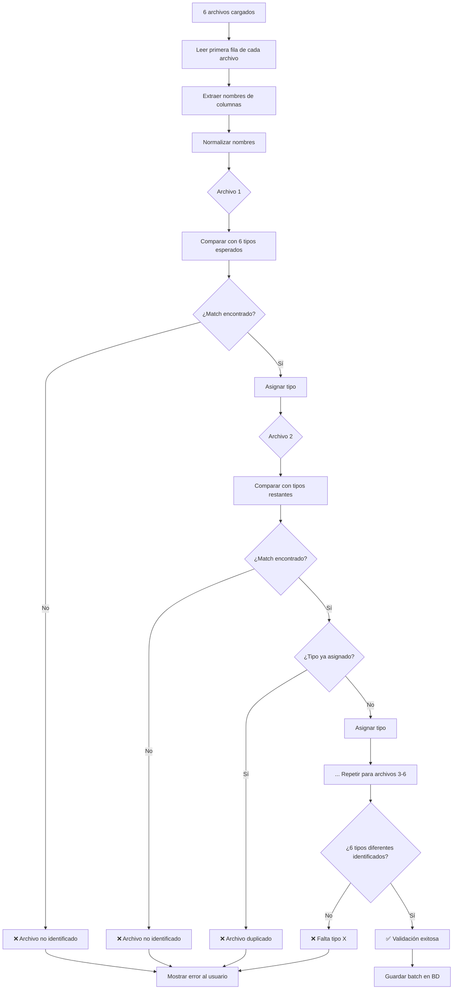
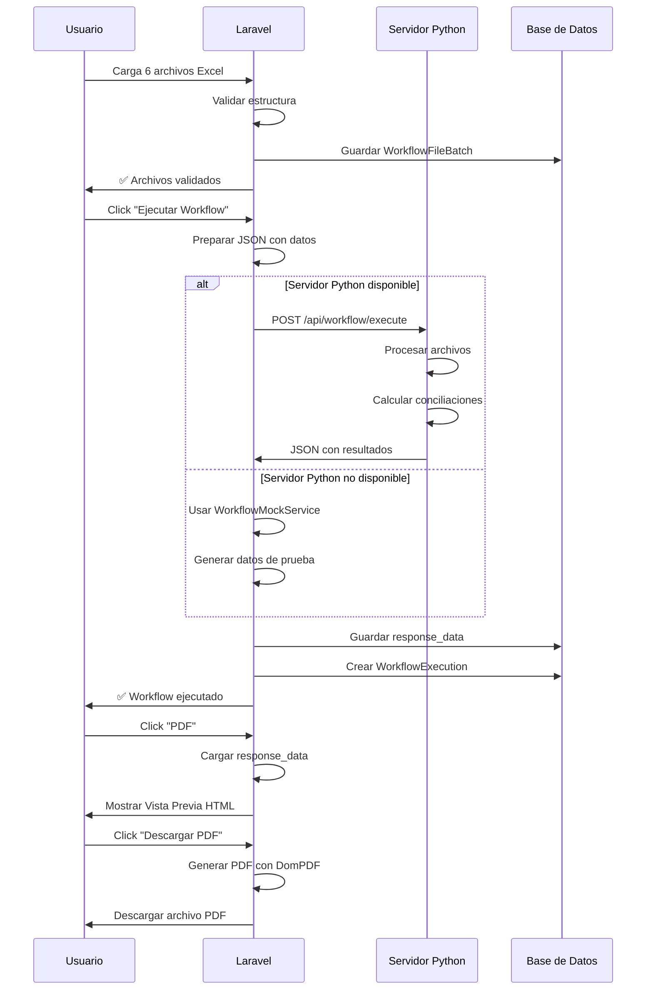
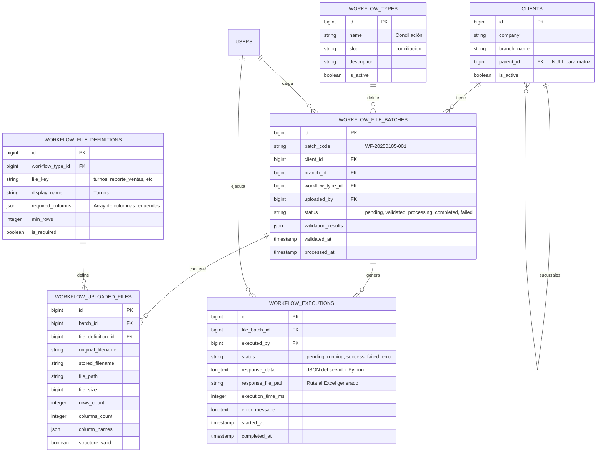
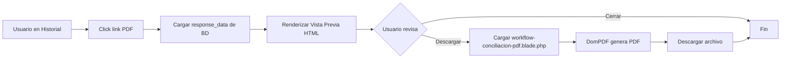
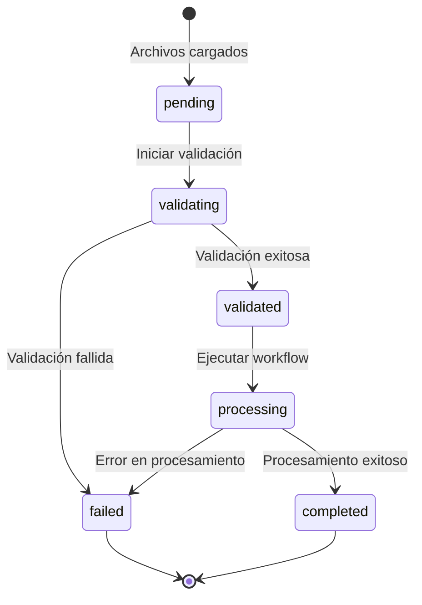
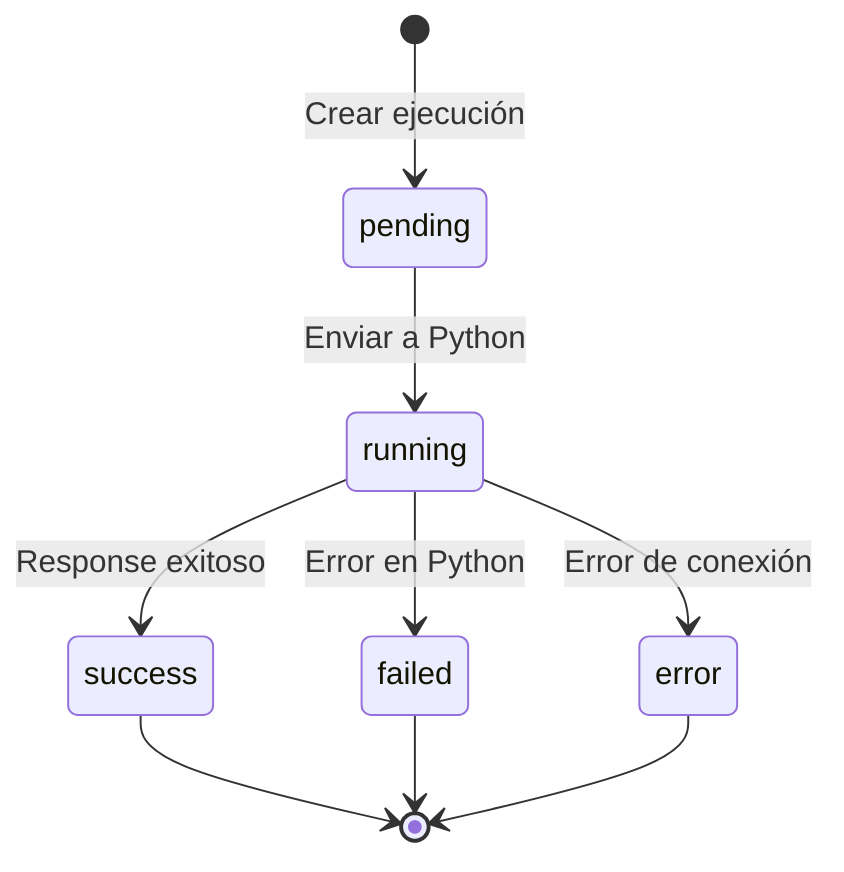

# Diagramas del Sistema de Workflows

## Flujo Completo del Sistema

```mermaid
graph TD
    Start([Programador inicia sesión]) --> Dashboard[Dashboard Programador]
    Dashboard --> UploadWizard[Wizard de Carga de Archivos]
    
    UploadWizard --> Step1[Paso 1: Seleccionar Cliente y Sede]
    Step1 --> Step2[Paso 2: Seleccionar Tipo de Workflow]
    Step2 --> Step3[Paso 3: Cargar 6 Archivos Excel]
    
    Step3 --> ValidateFiles{Validación de Archivos}
    ValidateFiles -->|❌ Error| ShowErrors[Mostrar errores específicos]
    ShowErrors --> Step3
    
    ValidateFiles -->|✅ Válido| AnalyzeStructure[Analizar estructura de columnas]
    AnalyzeStructure --> MatchTypes[Identificar tipo de cada archivo]
    
    MatchTypes --> CheckComplete{¿6 tipos diferentes?}
    CheckComplete -->|No| ShowErrors
    CheckComplete -->|Sí| CreateBatch[Crear WorkflowFileBatch]
    
    CreateBatch --> SaveFiles[Guardar archivos en storage]
    SaveFiles --> BatchReady[Batch status: validated]
    
    BatchReady --> ExecuteWorkflow[Ejecutar Workflow]
    ExecuteWorkflow --> PrepareJSON[Preparar JSON para Python]
    
    PrepareJSON --> SendToPython{Servidor Python disponible?}
    SendToPython -->|No| UseMock[Usar WorkflowMockService]
    SendToPython -->|Sí| CallPython[POST /api/workflow/execute]
    
    UseMock --> ReceiveResponse[Recibir JSON de respuesta]
    CallPython --> ReceiveResponse
    
    ReceiveResponse --> ValidateResponse{¿Response válido?}
    ValidateResponse -->|No| LogError[Registrar error]
    ValidateResponse -->|Sí| SaveResponse[Guardar en response_data]
    
    SaveResponse --> CreateExecution[Crear WorkflowExecution]
    CreateExecution --> UpdateStatus[Status: completed]
    
    UpdateStatus --> ShowHistory[Mostrar en Historial]
    ShowHistory --> UserClickPDF[Usuario click PDF]
    
    UserClickPDF --> PreviewPage[Abrir Vista Previa HTML]
    PreviewPage --> UserReview{Usuario revisa}
    
    UserReview -->|Descargar| GeneratePDF[Generar PDF con DomPDF]
    UserReview -->|Cerrar| End([Fin])
    
    GeneratePDF --> DownloadPDF[Descargar archivo PDF]
    DownloadPDF --> End
    
    LogError --> End
```



## Flujo de Validación de Archivos



## Integración con Servidor Python



## Arquitectura de Base de Datos



## Estructura JSON - Request a Python

```json
{
  "workflow_type": "conciliacion",
  "batch_id": 14,
  "batch_code": "WF-20250105-001",
  "files": [
    {
      "type": "turnos",
      "path": "/storage/workflows/batch_14/turnos.xlsx",
      "original_name": "Turnos.xlsx",
      "rows": 45,
      "columns": 12
    },
    {
      "type": "reporte_ventas",
      "path": "/storage/workflows/batch_14/reporte_ventas.xlsx",
      "original_name": "Ventas Enero.xlsx",
      "rows": 1250,
      "columns": 15
    },
    {
      "type": "reporte_getnet",
      "path": "/storage/workflows/batch_14/getnet.xlsx",
      "original_name": "Getnet.xlsx",
      "rows": 450,
      "columns": 8
    },
    {
      "type": "ventas_mp",
      "path": "/storage/workflows/batch_14/ventas_mp.xlsx",
      "original_name": "MP.xlsx",
      "rows": 320,
      "columns": 6
    },
    {
      "type": "devoluciones",
      "path": "/storage/workflows/batch_14/devoluciones.xlsx",
      "original_name": "Anulaciones.xlsx",
      "rows": 15,
      "columns": 10
    },
    {
      "type": "caja_adicion",
      "path": "/storage/workflows/batch_14/caja_adicion.xlsx",
      "original_name": "Caja.xlsx",
      "rows": 8,
      "columns": 7
    }
  ],
  "client": {
    "id": 1,
    "company": "Distribuidora San Martín S.A.",
    "branch": "Sucursal Palermo"
  },
  "metadata": {
    "uploaded_at": "2025-01-05T14:30:00-03:00",
    "uploaded_by": "Programador Principal"
  }
}
```

## Estructura JSON - Response de Python

```json
{
  "success": true,
  "execution_time_ms": 1250,
  "data": {
    "metadata": {
      "fecha": "12/02/2025",
      "dia": "Martes",
      "turno": "MAÑANA",
      "encargado": "Felipe",
      "hs_apertura": "11:10",
      "hs_cierre": "20:19",
      "sucursal": "PARADOR"
    },
    "enviar_sucursal": {
      "total_ventas": "816,500.00",
      "parador": {
        "cantidad_tickets": 9,
        "ticket_promedio": "90,722.22",
        "cantidad_comensales": 32,
        "comensales_promedio": "25,515.63"
      },
      "horarios_venta": {
        "apertura": "11:10",
        "primera_venta": "14:37",
        "ultima_venta": "20:09",
        "cierre": "20:19"
      },
      "diferencias_caja": {
        "mercado_pago": {
          "real": "169,100.00",
          "sistema": "0.00",
          "diferencia": "-169,100.00",
          "porcentaje": "0.00"
        },
        "getnet": {
          "real": "747,740.00",
          "sistema": "747,740.00",
          "diferencia": "0.00",
          "porcentaje": "0.00"
        },
        "efectivo": {
          "apertura_caja": "138,260.00",
          "recuento_real": "191,060.00",
          "diferencia": "191,060.00"
        }
      },
      "facturacion": {
        "real": "841,700.00",
        "ideal": "747,740.00",
        "diferencia": "93,960.00",
        "desvio_porcentaje": "12.57"
      }
    },
    "enviar_egresos": {
      "caja_adicion": [...],
      "mercado_pago": [...]
    },
    "enviar_no_conciliados": {
      "mercado_pago": {...},
      "getnet": {...},
      "efectivo_cta_cte": {...}
    },
    "enviar_anulaciones": [...]
  }
}
```

## Flujo de Generación de PDF



## Roles y Permisos

| Acción | Programador | Operador | Admin |
|--------|-------------|----------|-------|
| Cargar archivos | ✅ | ❌ | ✅ |
| Ejecutar workflow | ✅ | ❌ | ✅ |
| Ver historial | ✅ | ✅ | ✅ |
| Ver vista previa PDF | ✅ | ✅ | ✅ |
| Descargar PDF | ✅ | ✅ | ✅ |
| Ver /test | ✅ | ❌ | ✅ |
| Configurar tipos de workflow | ❌ | ❌ | ✅ |

## Estados del Sistema

### Estados de WorkflowFileBatch



### Estados de WorkflowExecution



## Checklist de Validación

Durante la carga de archivos, el sistema verifica:

### Validaciones de Cantidad
- ✅ **Cantidad de archivos**: Exactamente 6 archivos
- ✅ **Tamaño máximo**: Cada archivo < 10MB
- ✅ **Formato**: Todos deben ser archivos Excel válidos (.xlsx)

### Validaciones de Estructura
- ✅ **Columnas requeridas**: Cada archivo debe tener las columnas especificadas
- ✅ **Tipos únicos**: No puede haber archivos duplicados del mismo tipo
- ✅ **Tipos completos**: Deben estar presentes los 6 tipos requeridos
- ✅ **Contenido**: Al menos 1 fila de datos (además del header)

### Validaciones de Nombres de Columnas
- ✅ **Normalización**: Se normalizan nombres (lowercase, sin acentos)
- ✅ **Matching flexible**: No importa el orden de las columnas
- ✅ **Columnas extra**: Se permiten columnas adicionales

## Archivos del Sistema

### Backend
- `app/Http/Controllers/WorkflowBatchController.php` - Controlador principal
- `app/Http/Controllers/WorkflowPdfController.php` - Controlador de PDFs
- `app/Services/WorkflowMockService.php` - Servicio mock para pruebas
- `app/Livewire/WorkflowFileUploadWizard.php` - Wizard de carga
- `app/Livewire/WorkflowHistoryTable.php` - Tabla de historial

### Vistas
- `resources/views/livewire/workflow-file-upload-wizard.blade.php` - Wizard
- `resources/views/pdfs/workflow-conciliacion-preview.blade.php` - Vista previa
- `resources/views/pdfs/workflow-conciliacion-pdf.blade.php` - Template PDF

### Rutas
```php
// Wizard de carga
GET /programadores/workflows/upload

// Historial
GET /programadores/workflows/history

// Vista previa PDF
GET /programadores/workflows/execution/{id}/pdf/preview

// Descarga PDF
GET /programadores/workflows/execution/{id}/pdf/download

// Testing
GET /programadores/workflows/test
```

## Referencias

- [Estrategia de Validación](file:///d:/Front-Api/docs/Lógica_del_diseño/workflows_validation_strategy.md) - Documentación completa de validación
- [API Contract](file:///d:/Front-Api/docs/Desarrollos/pdf_preferencias/API_CONTRACT.md) - Contrato con servidor Python
- [Tablas](file:///d:/Front-Api/docs/Lógica_del_diseño/tablas.md) - Esquema completo de base de datos
